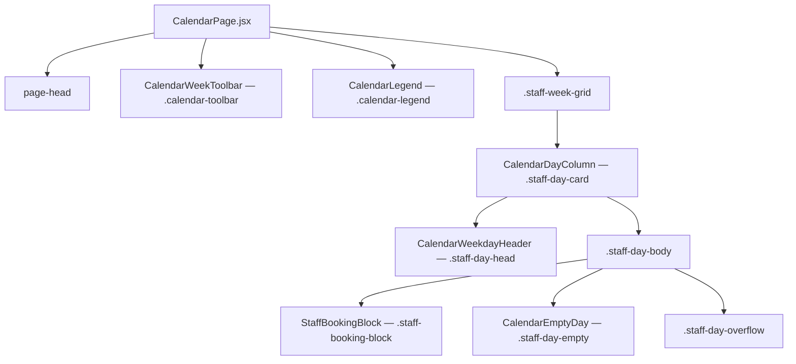
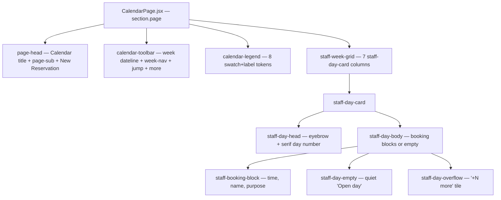

# Design Document: Calendar Week View Redesign

## Overview

The Calendar tab's week view is the screen staff land on most often, and it has accumulated visual noise: a redundant giant-serif day number stacked over a duplicate `May 17` line; cancelled bookings carrying both a line-through and a redundant `Cancelled` pill; truncated booking text running into mid-word ellipses; a legend strip whose pill chips wrap and clip at common widths; an "empty day" tile that competes with real bookings for visual weight; and a toolbar that mixes a serif-style label, a segmented pill, a native date input, and a dropdown trigger with no shared rhythm. The result reads as a busy spreadsheet rather than a calm desk ledger.

This redesign keeps every existing capability — week navigation, jump-to-date, the More actions menu, the legend, today highlighting, status-aware booking blocks, admin maintenance / clear-public-use entry points — and changes only how each is presented. It removes one signal whenever two are doing the same job, picks one place for orientation type instead of two, and equalizes the toolbar so each control reads at the same height and weight. It does not introduce a single new color, font, surface tint, shadow, or radius. Every change references a token that already lives in `client/src/styles.css` and a rule that already lives in the project `DESIGN.md`.

This is a UI redesign of an existing surface (`client/src/pages/CalendarPage.jsx`). It does not change the data layer (`/api/schedule`), the status taxonomy, the routing, the maintenance modal, the clear-public-use modal, or the offline-first staff-mediated workflow defined in `PRODUCT.md`. Anything that the redesign hides from the resting view is reachable in one click (More actions menu, day overflow drawer for >4 bookings).

---

## What This Redesign Explicitly Rejects

The following patterns from the current implementation are removed by this redesign. They are listed here so reviewers and the implementation phase have an unambiguous "do not bring back" list.

| # | Rejected pattern | Why | Replaced by |
|---|------------------|-----|-------------|
| R1 | Doubled day number — large serif `17` followed by `May 17` underneath | Two orientation signals for the same datum; violates "Title Has a Job Rule" by repeating the serif moment | One serif day number, one caps day-name eyebrow. Month context lives in the toolbar week-label only. |
| R2 | `Cancelled` pill rendered inside the booking block on top of the line-through name and danger-red time | Three signals (color, strikethrough, pill) for one state; violates "Premium utility" by spending visual weight redundantly | Line-through name + danger time + danger left-bar carry "cancelled". No pill inside the block. The pill survives in the legend only, where its only job is mapping. |
| R3 | Mid-word ellipsis on booking name (`Codex Browser QA…`) and clipped purpose lines | Single-line clamp under vertical pressure swallows whole words | 2-line `-webkit-line-clamp` already declared on `.staff-booking-name` and `.staff-booking-purpose`; redesign also caps the visible booking count per day at 4 and surfaces the rest behind a `+N more` overflow tile so each visible block keeps room for two readable lines. |
| R4 | Reference number rendered inside the day-card booking block (`Ref: BSN-2026-…`) | Repeats inside every block but is only ever read on click. Burns a fourth line of vertical room | Reference moves out of the day-card block. It already shows on the reservation drawer, the detail page, and the daily print. The block keeps time, name, purpose only. |
| R5 | `No bookings` empty state rendered as a dashed civic-blue-softer panel with bold `strong` text | Visually competes with real bookings; reads as "something here" instead of "open" | Quiet inline text "Open day" in 13px ink-muted italic, no border, no fill. Day-card height stays consistent through the day-card `min-height` (already declared). |
| R6 | Legend rendered as a row of full `.status-badge` pills (`Available`, `Reserved`, …) | Each pill is ~110–160px wide; eight chips overflow common widths; the right-most chip clipped in the screenshot | Legend chips become 12×12 swatches matching the booking-block left-bar treatment (`1px border + 4px left bar`) plus a 13px label. ~80–90px each, eight tokens fit on one row at 1280px. The status-badge primitive is preserved for in-page reservation references where the pill chrome is still appropriate. |
| R7 | "Current week" label rendered with both an uppercase eyebrow word and a 18/700 Inter title, while the segmented week-nav and the More actions trigger sit at 40px height in the same toolbar | Mixed control heights inside one container; staff eye has to recalibrate per zone | Toolbar uses one rhythm: a left-aligned dateline (eyebrow + week range), a center-right segmented week-nav at the staff control height (48px), and a right-aligned "Jump to date" + "More actions" pair, both also 48px. Three zones, one height. |
| R8 | `JUMP TO DATE` rendered as an uppercase label above a native date picker, sitting visually adjacent to the segmented `This week` pill | Two competing label styles for two adjacent controls | Date control absorbs the label inside the input as an inline `Jump to` prefix in 13px caps muted-ink (existing `.compact-date span` token). The native picker keeps its keyboard semantics. |
| R9 | Color-only differentiation across the legend (eight near-identical pills colored only by hue) | Soft pill backgrounds at 13px label size approach the contrast floor for some staff; "Status Must Read Rule" wants form to back up color | Each legend token carries (a) a 4px colored left bar borrowed from the booking block, (b) a 1px border, and (c) a labeled word. Three signals, no color-only chip. |

None of these rejections require a new design token. Each one is a subtraction or a remap to an existing primitive.

---

## Architecture

The week view is a vertical stack of three regions inside the existing `<section className="page">`. The full architecture diagram, the desktop layout map, the tablet layout map, and the mobile layout map are documented in detail under [High-Level Design — Architecture](#architecture-1) below. The summary:



`CalendarPage.jsx` keeps fetch-and-derive (state, weekDays, itemsByDay, modals). The six presentational components below own their visual contracts. No data fetching escapes the page.

## Components and Interfaces

The named component decomposition lives in [Component Decomposition (Named)](#component-decomposition-named). Summary contract:

| Component | Class root | Owns |
|-----------|------------|------|
| `CalendarWeekToolbar` | `.calendar-toolbar` | three-zone toolbar, segmented week-nav, jump-to-date, more-actions |
| `CalendarLegend` | `.calendar-legend` | 8 swatch+label tokens, no in-legend pills |
| `CalendarWeekdayHeader` | `.staff-day-head` | eyebrow + sole serif day number, today fill |
| `CalendarDayColumn` | `.staff-day-card` | day body + visible-block cap (4) + overflow tile |
| `StaffBookingBlock` | `.staff-booking-block` | time/name/purpose stack, status via class only |
| `CalendarEmptyDay` | `.staff-day-empty` | quiet "Open day · Walang reserbasyon" italic |

Full prop signatures and responsibilities are in [Component Decomposition (Named)](#component-decomposition-named) under Low-Level Design.

## Data Models

The redesign does not introduce new data models. It consumes the existing schedule shape returned by `/api/schedule?date=YYYY-MM-DD` and rendered today by `CalendarPage.jsx`:

```pascal
STRUCTURE Day
  date: String      // YYYY-MM-DD in Manila TZ
  name: String      // 'Sun' .. 'Sat'
END STRUCTURE

STRUCTURE Reservation
  reservationId:        Number
  referenceNo:           String
  representativeName:    String
  purpose:               String
  startTime:             String   // HH:mm
  endTime:               String   // HH:mm
  statusCode:            String   // RESERVED | CANCELLED | MISSED | COMPLETED
  statusName:            String
END STRUCTURE

STRUCTURE Block
  blockId:    Number
  blockType:  String   // MAINTENANCE | BARANGAY_EVENT | CLEARED_PUBLIC_USE
  type:       String   // legacy alias for blockType
  reason:     String
  startTime:  String
  endTime:    String
  statusCode: String
  statusName: String
END STRUCTURE

STRUCTURE Item
  kind:        'reservation' | 'block'
  id:          Number
  startTime:   String
  endTime:     String
  statusCode:  String
  statusName:  String
  reservation?: Reservation     // when kind = 'reservation'
  block?:      Block            // when kind = 'block'
END STRUCTURE

// Page-derived map; built by buildItemsByDay() in CalendarPage.jsx
TYPE ItemsByDay = Map<String /* date */, Item[] /* sorted by startTime */>
```

The status taxonomy (8 codes: AVAILABLE, RESERVED, COMPLETED, MISSED, CANCELLED, MAINTENANCE, BARANGAY_EVENT, CLEARED_PUBLIC_USE) is unchanged. The `getStatusDisplay(code, name)` helper in `client/src/api/statusDisplay.js` already maps each code to a `{ className, label }` pair — the redesign reuses this map verbatim.

## Correctness Properties

The redesign's visual rules are testable as universal-quantification statements over the rendered DOM. The full pseudocode form lives in [Low-Level Design — Correctness Properties](#correctness-properties-1); the named, numbered properties are listed here.

### Property 1: Day number renders exactly once per card

For every day card `d` in the week grid, `d.querySelectorAll('.staff-day-head-num').length === 1` and `d.querySelectorAll('.staff-day-head small').length === 0`. The duplicated giant-serif `17` over `May 17` cannot return.

**Validates: Requirements 1.1, 1.2, 1.3, 1.4, 1.5, 9.1, 9.2, 9.3, 9.4**

### Property 2: No in-block status pill

For every `.staff-booking-block`, `b.querySelectorAll('.status-badge').length === 0`. Status is signaled by the block chrome (fill, bar, time color, optional strike), not by an additional pill inside the block.

**Validates: Requirements 2.4**

### Property 3: Cancelled and missed names carry strikethrough

For every `.staff-booking-block.status-cancelled` and `.staff-booking-block.status-missed`, the computed `text-decoration-line` of `.staff-booking-name` contains `line-through`. Strikethrough is one of the two redundant text-or-form signals that backs up color for these statuses.

**Validates: Requirements 2.1, 2.2, 2.3**

### Property 4: No reference number inside any block

For every `.staff-booking-block`, `textContent(b)` does not match `/^Ref:/m`. The reference survives in the drawer, the detail page, the daily print, and the block's `aria-label` — it never burns a fourth visible line inside a day-card block.

**Validates: Requirements 3.1, 3.2, 3.3, 3.4, 3.5**

### Property 5: Legend renders swatches, not pills

For every `.calendar-legend-item`, the item contains exactly one `.legend-swatch` and zero `.status-badge` descendants. The legend's job is mapping a swatch to a status word; it does not double as a pill gallery.

**Validates: Requirements 7.1, 7.2, 7.3, 7.4, 12.2**

### Property 6: Legend does not horizontally clip at desktop

At viewport width ≥ 1280px, every `.calendar-legend` satisfies `clientWidth >= scrollWidth - 1`. No legend item, including "Cleared for public use", falls off the right edge.

**Validates: Requirements 7.5**

### Property 7: Every toolbar control honors the 48px staff-control height

For every interactive child of `.calendar-toolbar` matching `.calendar-week-nav-btn, .date-input, .calendar-more-trigger`, the computed height is ≥ 48px. The "Staff Can Read It Rule" applies uniformly across the toolbar, not just to the more-actions button.

**Validates: Requirements 6.1, 6.2, 6.3, 6.4, 6.5, 9.5, 9.6, 14.3**

### Property 8: Per-day overflow surfaces beyond 4 bookings

For every day with `items.length > 4`, exactly 4 `.staff-booking-block`s render plus one `.staff-day-overflow` button whose visible text matches `/^\+\s*\d+\s+more$/` and whose accessible name matches `/^\+\s*\d+\s+more bookings on /`. Days with `items.length <= 4` render zero overflow tiles.

**Validates: Requirements 5.1, 5.2, 5.3, 5.4, 5.5**

### Property 9: Empty days render the quiet "Open day" line

For every day with `items.length === 0`, `.staff-day-empty` contains the string `Open day`. It does not carry the dashed civic-blue-softer panel chrome (no `border-style: dashed`, no `--primary-softer` background fill).

**Validates: Requirements 4.1, 4.2, 4.3, 4.4, 4.5, 4.6, 14.1, 14.2**

### Property 10: Status word reaches assistive technology

For every `.staff-booking-block`, the block's `aria-label` contains the status label string returned by `getStatusDisplay()`. Dropping the visible pill does not weaken the screen-reader path.

**Validates: Requirements 2.5, 11.1, 11.2, 11.3, 13.1, 13.2**

### Property 11: Single roving tabindex inside the week grid

For every `.staff-week-grid`, `g.querySelectorAll('[tabindex="0"]').length <= 1`. Keyboard staff press Tab once to enter the grid and arrow keys to move within it; they never have to Tab through 28+ booking blocks to leave.

**Validates: Requirements 8.1, 8.2, 8.3, 8.4, 8.5, 8.6**

### Property 12: Weekend cards render identically to weekday cards

For every day `d` where `d.isWeekend === true`, the computed background and text color of `d.head` equal the corresponding weekday-head values. No weekend muting, no italicized day-name eyebrow, no reduced-opacity tile.

**Validates: Requirements 10.1, 10.2, 10.3, 12.1, 12.3, 12.4, 12.5**

## Error Handling

No new error paths are introduced. The three existing scenarios continue to render as today. Detail in [Low-Level Design — Error Handling](#error-handling-1).

## Testing Strategy

The full breakdown (DOM tests, visual regression, accessibility) lives in [Low-Level Design — Testing Strategy](#testing-strategy-1). Summary: every correctness property above translates to a `@testing-library/react` query, plus existing Playwright snapshots cover toolbar alignment, day-head height, legend wrap behaviour, and per-day overflow.

---

## High-Level Design

### Architecture

The week view is a vertical stack of three regions inside the existing `<section className="page">`. The redesign keeps the same three regions but rebalances each one's visual weight.



### Layout Map (Resting State, ≥1280px)

```
┌────────────────────────────────────────────────────────────────────────────────────────┐
│  Calendar                                                                              │
│  May 17 – May 23, 2026                                                 ┌──────────────┐ │
│  Tingnan ang lahat ng reserbasyon ngayong linggo.                      │ + New        │ │
│                                                                        │   Reservation │ │
│                                                                        └──────────────┘ │
├────────────────────────────────────────────────────────────────────────────────────────┤
│ ┌─────────────────────┐  ┌──────────────────────┐  ┌──────────────────┐  ┌──────────┐ │
│ │ WEEK OF             │  │ ◀  This week  ▶     │  │ Jump to  [date]  │  │ More  ▾  │ │
│ │ May 17 – May 23     │  │                      │  │                  │  │          │ │
│ │ 2026                │  │                      │  │                  │  │          │ │
│ └─────────────────────┘  └──────────────────────┘  └──────────────────┘  └──────────┘ │
│  ↑ dateline                ↑ segmented 48px         ↑ 48px combo         ↑ 48px        │
├────────────────────────────────────────────────────────────────────────────────────────┤
│ STATUS LEGEND  ▢ Available  ▢ Reserved  ▢ Completed  ▢ Did not show  ▢ Cancelled       │
│                ▢ Maintenance  ▢ Barangay event  ▢ Cleared for public use               │
├────────────────────────────────────────────────────────────────────────────────────────┤
│ ┌──────┐ ┌──────┐ ┌──────────┐ ┌──────────────┐ ┌──────────┐ ┌──────────┐ ┌──────────┐│
│ │ SUN  │ │ MON  │ │ TUE      │ │ WED · TODAY  │ │ THU      │ │ FRI      │ │ SAT      ││
│ │      │ │      │ │          │ │ ▓▓▓▓▓▓▓▓▓▓▓ │ │          │ │          │ │          ││
│ │  17  │ │  18  │ │   19     │ │     20       │ │   21     │ │   22     │ │   23     ││
│ │serif │ │serif │ │ serif    │ │ serif white  │ │ serif    │ │ serif    │ │ serif    ││
│ ├──────┤ ├──────┤ ├──────────┤ ├──────────────┤ ├──────────┤ ├──────────┤ ├──────────┤│
│ │      │ │ ▌6:00 │ │ ▌7:00am  │ │ ▌5:30am      │ │ ▌6:00am  │ │          │ │ ▌5:30am  ││
│ │ Open │ │ Liga  │ │ QA Full  │ │ Codex Browser│ │ Maint.   │ │ Open day │ │ Health   ││
│ │ day  │ │ Cup   │ │ System   │ │ QA · Demo    │ │ Court    │ │          │ │ Drive    ││
│ │      │ │       │ │ Practice │ │              │ │ repair   │ │          │ │          ││
│ │      │ │ ▌2:00 │ │          │ │ ▌7:00am  ✗   │ │          │ │          │ │ ▌2:00pm  ││
│ │      │ │ Cncl  │ │          │ │ 32323232     │ │          │ │          │ │ Open jam ││
│ │      │ │       │ │          │ │ (line-thru)  │ │          │ │          │ │          ││
│ │      │ │       │ │          │ │              │ │          │ │          │ │ +2 more  ││
│ └──────┘ └──────┘ └──────────┘ └──────────────┘ └──────────┘ └──────────┘ └──────────┘│
└────────────────────────────────────────────────────────────────────────────────────────┘
```

Legend for the diagram: `▌` is the 4px civic-blue or danger-red left bar on a booking block; `▓` is the today-fill on `.staff-day-head.today`; `✗` indicates a cancelled block (line-through name, danger-red time bar, no pill).

### Layout Map (Tablet, ≤820px and >480px)

At ≤820px the existing `.staff-week-grid` rule already collapses the day grid from 7 columns to 2. The toolbar's existing media query already stacks its zones vertically (`flex-direction: column`, `align-items: stretch`). The redesign keeps both behaviours and adds nothing.

```
┌──────────────────────────────────────────────┐
│  Calendar                                    │
│  May 17 – May 23, 2026                       │
│  Tingnan ang lahat ng reserbasyon …          │
│                                              │
│  ┌────────────────────────────────────────┐  │
│  │ + New Reservation                      │  │
│  └────────────────────────────────────────┘  │
├──────────────────────────────────────────────┤
│  ┌──────────────────────────────────────┐    │
│  │ WEEK OF                              │    │
│  │ May 17 – May 23, 2026                │    │
│  └──────────────────────────────────────┘    │
│  ┌──────────────────────────────────────┐    │
│  │ ◀     This week     ▶                │    │
│  └──────────────────────────────────────┘    │
│  ┌──────────────────────────────────────┐    │
│  │ Jump to  [date]                      │    │
│  └──────────────────────────────────────┘    │
│  ┌──────────────────────────────────────┐    │
│  │ More actions ▾                       │    │
│  └──────────────────────────────────────┘    │
├──────────────────────────────────────────────┤
│ STATUS LEGEND                                │
│ ▢ Available  ▢ Reserved  ▢ Completed         │
│ ▢ Did not show  ▢ Cancelled  ▢ Maintenance   │
│ ▢ Barangay event  ▢ Cleared for public use   │
├──────────────────────────────────────────────┤
│ ┌─────────────────┐  ┌─────────────────────┐ │
│ │ SUN          17 │  │ MON              18 │ │
│ │                 │  │ ▌6:00am Liga Cup    │ │
│ │ Open day        │  │ ▌2:00pm ✗ Practice  │ │
│ └─────────────────┘  └─────────────────────┘ │
│ ┌─────────────────┐  ┌─────────────────────┐ │
│ │ TUE          19 │  │ WED · TODAY      20 │ │
│ │ ▌7:00am QA …    │  │ ▓▓▓▓▓▓▓▓▓▓▓▓▓▓▓▓▓▓ │ │
│ │ ▌11:30am Demo   │  │ ▌5:30am Codex …     │ │
│ └─────────────────┘  └─────────────────────┘ │
│ … two more rows for THU/FRI and SAT/—        │
└──────────────────────────────────────────────┘
```

The day-card head reduces to a single row (`grid-template-columns: 1fr auto`) per the existing `.staff-day-head` ≤820px rule, so `WED · TODAY` sits on the eyebrow line and `20` sits to its right. The serif day number stays the sole serif moment per day.

### Layout Map (Mobile, ≤480px)

At ≤480px `.staff-week-grid` collapses to a single column (existing rule). The toolbar zones remain stacked. Each day card takes the full content width.

```
┌──────────────────────────────────────────────┐
│  Calendar                                    │
│  May 17 – May 23, 2026                       │
│  Tingnan ang lahat ng reserbasyon …          │
│  ┌────────────────────────────────────────┐  │
│  │ + New Reservation                      │  │
│  └────────────────────────────────────────┘  │
├──────────────────────────────────────────────┤
│  WEEK OF                                     │
│  May 17 – May 23, 2026                       │
│  ┌──────────────────────────────────────┐    │
│  │ ◀     This week     ▶                │    │
│  └──────────────────────────────────────┘    │
│  ┌──────────────────────────────────────┐    │
│  │ Jump to  [date]                      │    │
│  └──────────────────────────────────────┘    │
│  ┌──────────────────────────────────────┐    │
│  │ More actions ▾                       │    │
│  └──────────────────────────────────────┘    │
├──────────────────────────────────────────────┤
│ STATUS LEGEND (wraps to 2–3 rows; same       │
│  swatch+label tokens, no clipping)           │
├──────────────────────────────────────────────┤
│ ┌──────────────────────────────────────────┐ │
│ │ TUE · TODAY                          19  │ │
│ ├──────────────────────────────────────────┤ │
│ │ ▌ 7:00am – 8:00am                        │ │
│ │   QA Full System Practice                │ │
│ │   Demo testing for sprint review         │ │
│ │ ▌ 11:30am – 12:30pm                      │ │
│ │   Liga Cup Pre-Game                      │ │
│ │   Practice                               │ │
│ │ + 2 more                                 │ │
│ └──────────────────────────────────────────┘ │
│ ↓ next day card stacks below                 │
└──────────────────────────────────────────────┘
```

`.staff-day-card` drops its 360px `min-height` at this width (existing `min-height: auto` rule for `≤480px`). Each card collapses to its content height. The booking block keeps the same internal stack — time, name (2-line clamp), purpose (2-line clamp). `+ N more` retains the per-day overflow drawer pattern.

### Component Decomposition (Named)

The current `CalendarPage.jsx` keeps every concern in one file. The redesign extracts six small presentational components so the toolbar, the legend, the per-day column, and the booking block each own their visual contract. Every component renders existing class roots; no component owns its own colors, fonts, or shadow tokens.

| Component | File (proposed) | Class root | Responsibilities | Props (shape only) |
|-----------|-----------------|------------|------------------|--------------------|
| `CalendarWeekToolbar` | `client/src/components/calendar/CalendarWeekToolbar.jsx` | `.calendar-toolbar` | Renders the three-zone toolbar: dateline, segmented week-nav, jump-to-date + more-actions. Owns the segmented `aria-pressed` semantics on `This week`. Does not own data fetching. | `weekLabel: string`, `weekDays: Day[]`, `today: string`, `date: string`, `isAdmin: boolean`, `onSelectDate(dateKey)`, `onPrev()`, `onNext()`, `onJumpToToday()`, `onDailyPrint()`, `onAddMaintenance()`, `onClearPublicUse()` |
| `CalendarLegend` | `client/src/components/calendar/CalendarLegend.jsx` | `.calendar-legend` | Renders the 8 swatch+label tokens. Pure render; no state. | `entries: { code, name, modifier }[]` |
| `CalendarWeekdayHeader` | `client/src/components/calendar/CalendarWeekdayHeader.jsx` | `.staff-day-head` | Renders one day-card head: eyebrow `<span>` and serif `<strong>` only. Owns the `.today` toggle. | `name: string`, `dayNumber: number`, `isToday: boolean` |
| `CalendarDayColumn` | `client/src/components/calendar/CalendarDayColumn.jsx` | `.staff-day-card` | Composes `CalendarWeekdayHeader` plus the day body. Applies the visible-block cap (`MAX_VISIBLE_BLOCKS = 4`) and renders the overflow tile. Owns the per-day drawer trigger. | `day: { date, name }`, `items: Item[]`, `isToday: boolean`, `isAdmin: boolean`, `onOpenDay(day, items)`, `onOpenReservation(id)`, `onDeactivateBlock(block)` |
| `StaffBookingBlock` | `client/src/components/calendar/StaffBookingBlock.jsx` | `.staff-booking-block` | Renders one booking or block row with time, name, purpose. Carries status via `${statusClass}` only — never via an in-block pill. Owns the keyboard activation contract (Enter/Space → click). | `kind: 'reservation' \| 'block'`, `range: string`, `name: string`, `purpose: string`, `statusCode: string`, `statusLabel: string`, `referenceLabel?: string`, `onActivate()`, `adminAction?: { label, onClick }` |
| `CalendarEmptyDay` | `client/src/components/calendar/CalendarEmptyDay.jsx` | `.staff-day-empty` | Renders the quiet "Open day · Walang reserbasyon" italic line. No interactions. | _none_ |

`CalendarPage.jsx` keeps its fetch-and-derive job (it owns the `state`, the `weekDays`, the `itemsByDay` map, and the modal toggles) and assembles the six components.

### Bilingual Italic Moments

Per the "Bilingual Italic Rule" (DESIGN.md §3) and PRODUCT.md's "Plain labels beat clever labels", the redesign keeps Filipino italic helper text where it lowers staff hesitation. Each addition uses the existing `.page-sub-fil` and `.field-label .fil` typography tokens — muted-ink Inter italic, 13–14px, never replacing the English label.

| Surface | English (primary) | Filipino italic (helper) | Class |
|---------|-------------------|--------------------------|-------|
| Page header | "Calendar" / "May 17 – May 23, 2026" | "Tingnan ang lahat ng reserbasyon ngayong linggo." | `.page-sub-fil` (existing — kept as-is) |
| Empty day card | "Open day" | "Walang reserbasyon" | `.staff-day-empty .fil` (new modifier on existing `.fil` italic style) |
| Toolbar dateline eyebrow | "Week of" | _no Filipino — the dateline is operational, not orientational_ | n/a |
| Legend label | "Status legend" | _no Filipino — a label, not a workflow cue_ | n/a |
| `+ N more` overflow tile | "+ N more" | _no Filipino — plain count_ | n/a |
| Error state | (existing alert) | _no change_ | n/a |

The empty-day Filipino line is the only new bilingual moment. It survives in 13px italic ink-muted on the same line as "Open day" or stacked underneath, depending on width:

```
≥820px:  Open day · Walang reserbasyon
<820px:  Open day
         Walang reserbasyon
```

The toolbar stays English-only because the toolbar is operational (move, jump, open menu), not orientational. Filipino at every label inflates the visual budget without lowering hesitation; the rule says "where it lowers hesitation", not "everywhere".

### Region 1 — Toolbar (Redesigned)

**Goal:** one consistent rhythm across three zones; controls at the same height; no doubled labels.

**Three zones, one row:**

1. **Dateline** (left, `mr-auto`). A two-line block that mirrors the masthead pattern `DESIGN.md` already uses for orientation moments (eyebrow + label). The eyebrow word stays "Week of" in 11px/700 caps muted-ink (matches `.calendar-legend-label`); the label below is the date range in 18px/700 Inter ink. The label stays Inter — not serif — because the page title above already carries the serif orientation moment for this screen, and the "Title Has a Job Rule" forbids a second serif within 60px of the first.

2. **Week navigator** (center-right). Keeps the existing segmented `calendar-week-nav` group control unchanged in structure (prev / This week / next). Its height is bumped from 40px to 48px so the toolbar reads at the staff-control height ("Staff Can Read It Rule": staff-touched controls stay at 48px minimum). The middle "This week" pill keeps `is-current` semantics: when `weekIncludesDate(weekDays, today)` is true, the pill carries `aria-pressed` and tints to `--primary-softer` with `--primary` text.

3. **Jump-to-date + More actions** (right). Two equal-height (48px), equal-weight light controls. The `Jump to date` label collapses inside the input as a 13px/600 caps muted-ink prefix (existing `.compact-date span` style; rendered as a bordered combo where the label sits to the left of the date input on the same baseline). The More actions trigger keeps `.btn.btn-light.calendar-more-trigger` and the existing menu, with the menu pinned to the right edge as today.

**What's gone from the current toolbar:**
- The "CURRENT WEEK" eyebrow + serif-feeling 18px label competing for visual weight at the same time as the segmented nav. The eyebrow stays, the visual weight equalizes.
- The standalone uppercase "JUMP TO DATE" label sitting above its input. The label moves inline.
- Inconsistent control heights (40px segmented + 54px native input + 48px button). All three become 48px.

### Region 2 — Legend (Redesigned)

**Goal:** all eight legend tokens fit one row at 1280px without any token clipping.

The legend keeps its current placement directly under the toolbar and its current paper-style container (`.calendar-legend` with 1px border, 10px radius, white surface, ink-2 text). What changes is each item's chrome.

```
Before (current):  [STATUS][·][Available]  [STATUS][·][Reserved]  …  [STATUS][·][Cleared|]  ← clipped
After  (redesign): STATUS LEGEND   ▢ Available   ▢ Reserved   ▢ Completed   ▢ Did not show
                                   ▢ Cancelled   ▢ Maintenance   ▢ Barangay event   ▢ Cleared for public use
```

**Each legend token** is a 12×12 swatch (`.legend-swatch`, already defined in `client/src/styles.css` as a 1px-bordered square with a 4px colored left edge) plus a 13px/600 Inter label. The swatch's left-bar color and fill background match the corresponding booking-block treatment one-to-one, so the visual mapping in staff's head is "the bar in the legend equals the bar in the day card" rather than "this colored pill equals which dot in the day card?".

**Mapping (every item references existing tokens):**

| Legend item | Swatch left-bar | Swatch fill | Class |
|-------------|-----------------|-------------|-------|
| Available | `--success` | `--success-soft` | `.legend-available` |
| Reserved | `--primary` | `--primary-softer` | `.legend-reserved` (already declared) |
| Completed | `--ink-muted` | `--surface` | `.legend-completed` (already declared) |
| Did not show | `--danger` | `--danger-soft` | `.legend-missed` (already declared) |
| Cancelled | `--danger` | `--danger-soft` | `.legend-cancelled` (already declared) |
| Maintenance | `--warning` | `--alert-warning-bg` | `.legend-maintenance` (new selector, existing tokens) |
| Barangay event | `--primary` | `--primary-softer` | `.legend-barangay` (new selector, existing tokens) |
| Cleared for public use | `--border-strong` | `--surface-2` | `.legend-cleared` (new selector, existing tokens) |

The current implementation renders `<span class="status-badge status-X">…</span>` inside each legend item. The redesign renders `<span class="legend-swatch"></span><span>Label</span>` instead. The pill primitive is left untouched for in-page reservation references where it remains the right call.

### Region 3 — Weekday Header (Redesigned)

**Goal:** one orientation moment per day, not two.

```
Before (current, ~104px tall)            After (redesign, ~80px tall)
┌──────────────┐                          ┌──────────────┐
│ Tuesday      │ ← caps eyebrow           │ TUE          │ ← caps eyebrow (single line)
│              │                          │              │
│   17         │ ← serif 34px             │     17       │ ← serif 30px (sole orientation)
│              │                          │              │
│   May 17     │ ← duplicate small        │              │
└──────────────┘                          └──────────────┘
```

**Resting (non-today) state.** The card-head is white (paper surface), the day-name eyebrow is 13px/600 caps ink-muted with 0.06em letter-spacing (label scale, matches the legend label), and the day number is 30–32px Instrument Serif Regular ink-2. The day number is the only serif moment inside the day card — every booking block, every status word, every time string is Inter. Repeating the serif here is justified because each day card is its own independent orientation surface (a "chapter heading" within the week), exactly the kind of moment the "Title Has a Job Rule" allows.

**Today state.** The same head, with `--primary` background fill and white text (the existing `.staff-day-head.today` rule). The "Today" word is appended to the eyebrow line as a separator dot pair: `TUE · TODAY`. It is not stacked under the day name as a second line. Today is the one card whose head row reads as two pieces of information (which day, that-day-is-today), and they share one row.

**What's gone:**
- The third line `May 17`. The toolbar already says "Week of May 17 – May 23, 2026"; the day card is inside that frame, so re-stating the month next to the day number is redundant.
- The 104px head height. New head reads at ~80px, which gives the day body 24 extra vertical pixels for actual bookings without changing the day-card `min-height`.

### Region 4 — Booking Block (Redesigned)

**Goal:** one signal per status; no doubled chrome.

The block keeps its existing chrome (8px radius, 1px border, 4px civic-blue or danger left bar, soft-civic-blue or danger-soft fill, hover lift with civic-blue ring). What changes is what's rendered inside the block and how each status decorates it.

**Internal stack (top to bottom):**

```
┌─────────────────────────────────┐
│▌ 7:00 am – 8:00 am              │  ← time, 13px/700 Inter, civic-blue (or danger when missed/cancelled)
│  QA Full System Practice        │  ← name, 15px/700 Inter ink, 2-line clamp
│  Demo testing for sprint review │  ← purpose, 12px/600 Inter ink-muted, 2-line clamp
└─────────────────────────────────┘
```

**Removed from the block:**
- The reservation reference line (`Ref: BSN-2026-…`). It survives in the drawer, the detail page, and the daily print, none of which are constrained by the day-card vertical budget. Inside the day card it's burning a fourth line for a value staff only ever reads after clicking through.
- The trailing `Cancelled` (or other) `.status-badge` pill. Status is signaled by the block chrome, not by an additional pill.

**Status-signal matrix:**

| Status | Time color | Time strike | Name strike | Block fill | Left bar | Pill in block? |
|--------|------------|-------------|-------------|------------|----------|----------------|
| Reserved (default) | `--primary` | no | no | `--primary-softer` | `--primary` 4px | no |
| Cancelled | `--danger` | no | yes | `--danger-soft` | `--danger` 4px | no |
| Missed (Did not show) | `--danger` | no | yes | `--danger-soft` | `--danger` 4px | no |
| Completed | `--ink-muted` | yes | no | `--surface` | `--ink-muted` 4px | no |
| Maintenance (block) | `--warning` (text token to be paired with bar; text uses `--alert-warning-text-strong` for AA contrast on the warning fill) | no | no | `--alert-warning-bg` | `--warning` 4px | no — type name `Maintenance` is the primary line |
| Barangay event (block) | `--primary` | no | no | `--primary-softer` | `--primary` 4px | no — type name `Barangay event` is the primary line |
| Cleared for public use (block) | `--ink-muted` | no | no | `--surface-2` | `--border-strong` 4px | no — type name `Cleared for public use` is the primary line |

Every row carries at least two text-or-form signals beyond color (for example, cancelled = strikethrough name + danger-red time + danger-red bar; completed = struck-through time + faded name + muted bar; maintenance = the word "Maintenance" as the title + warning-bar). The "Status Must Read Rule" passes for every status without a pill.

**Two-line clamp survives.** Both `.staff-booking-name` and `.staff-booking-purpose` keep `-webkit-line-clamp: 2` with `overflow-wrap: anywhere`. With reference removed and the head shorter, every block has room for two readable lines.

**Aria-label still carries the full status word** for screen readers, regardless of whether the block renders a visual pill: `${name}, ${range}, ${status.label}, reference ${referenceLabel}`. This is unchanged from the current implementation.

### Region 5 — Empty State (Redesigned)

**Goal:** an open day reads as breathing room, not as a decorated tile competing with bookings.

```
Before (current)                          After (redesign)
┌──────────────┐                          ┌──────────────┐
│ ┌──────────┐ │                          │              │
│ │  No      │ │  ← dashed civic-blue-    │              │
│ │  bookings│ │     softer panel,        │ Open day     │  ← 13px italic ink-muted,
│ │          │ │     bold text,           │              │     centered, no border, no fill
│ └──────────┘ │     168px min-height     │              │
└──────────────┘                          └──────────────┘
```

The day card's `min-height` (already 360px on `.staff-day-card`) holds the column shape steady whether the body is empty or full, so we don't need a tile to "fill" the space. The body just contains a single line of muted italic copy, vertically centered. No border, no fill, no `strong` tag. It reads as "no work scheduled" not "decorative empty box".

The label "Open day" replaces "No bookings" because the user is staff: "open" is the word they actually use ("the court is open from 5 to 7"), and it cues the next action (book it) more naturally than "no bookings" ever did.

### Region 6 — Per-Day Overflow (New, Minor)

**Goal:** when a day has more than 4 bookings, every block keeps its 2-line breathing room.

When `items.length > 4`, only the first four blocks render and a single `staff-day-overflow` button sits at the bottom of the day body with text `+ N more`. Clicking it opens a per-day drawer (the existing reservation drawer pattern, restated as a list). This trades vertical density for legibility and matches the "Clarity over density" principle directly.

When `items.length <= 4`, every block renders. No overflow tile.

This is a small new pattern. Its chrome (8px radius, 1px dashed border, 13px/600 muted-ink centered label) reuses the empty-state's dashed-border treatment in muted form, so it reads as "scrollable continuation" rather than a real booking. No new tokens.

---

### Token Alignment (High-Level)

Every visual choice in this redesign maps to a token that already lives in `client/src/styles.css`. There are no new colors, fonts, radii, shadows, or bespoke surface tints.

| Decision | Existing token |
|----------|----------------|
| Day-card border, divider lines | `--border` (#DCD6C7) |
| Day-card resting shadow | `--shadow` / `--shadow-md` |
| Toolbar resting shadow | `--shadow` / `--shadow-md` |
| Today-head fill | `--primary` (#0B4A6F) |
| Reserved booking fill | `--primary-softer` (#EFF5F8) |
| Reserved booking bar | `--primary` |
| Cancelled / missed booking fill | `--danger-soft` (#FADEDA) |
| Cancelled / missed booking bar | `--danger` (#B83B2A) |
| Cancelled / missed booking time | `--danger` |
| Completed booking bar | `--ink-muted` (#44505F) |
| Completed booking fill | `--surface` (#FFFFFF) |
| Maintenance booking fill | `--alert-warning-bg` (#FFF3D9) |
| Maintenance booking bar | `--warning` (#B4761A) |
| Maintenance booking text | `--alert-warning-text-strong` (#6D4A0D) |
| Barangay-event booking fill / bar | `--primary-softer` / `--primary` |
| Cleared-public-use fill | `--surface-2` (#F0ECE3) |
| Cleared-public-use bar | `--border-strong` (#B9B19E) |
| Day-name eyebrow text | `--ink-muted` |
| Day-number serif | `--font-serif` (Instrument Serif) |
| Body / labels Inter | `--font-sans` |
| Booking-block radius | 8px (matches existing `.staff-booking-block`) |
| Day-card radius | 12px (matches existing `.staff-day-card`) |
| Toolbar radius | 12px (matches existing `.calendar-toolbar`) |
| Legend radius | 10px (matches existing `.calendar-legend`) |
| Staff-control height | 48px (`DESIGN.md` "Staff Can Read It Rule") |
| Hover lift on booking | `translateY(-1px)` + `outline: 3px solid rgba(11,74,111,0.26)` (existing) |

---

### Cognitive Load Pass

The redesign holds to PRODUCT.md's "Clarity over density" by removing duplicated information rather than rearranging it:

- Three places that said "this is May 17" (toolbar, day-head serif number, day-head `May 17` line) collapse to two (toolbar + serif number). The day-head's `May 17` line is removed.
- Three signals that said "this booking is cancelled" (line-through name, danger-red bar, `Cancelled` pill) collapse to two (line-through name + danger-red bar+time). The pill is removed.
- Two labels that said "where am I in the calendar" (toolbar's `CURRENT WEEK` eyebrow + the page-sub `May 17 – May 23, 2026`) keep both but give the toolbar the orientation job and let the page-sub stay as the screen-level subtitle. The toolbar dateline gets a slightly smaller eyebrow so it doesn't fight the page subtitle for the same role.
- The reference number, useful only on click, leaves the day-card block. The drawer keeps it.

Each subtraction is a "one fewer thing to read at a glance" beat. The principle is conservative subtraction: anything removed survives somewhere reachable in one click.

---

## Low-Level Design

### Component Tree (JSX Shape)

This is the structural shape only. No code is given. Existing components and props are unchanged unless explicitly noted.

```
<section className="page">

  <div className="page-header page-head staff-page-head">              [unchanged from current]
    <div>
      <h1 className="page-title">Calendar</h1>
      <div className="page-sub">{weekLabel | 'Weekly schedule'}</div>
      <div className="page-sub-fil">Tingnan ang lahat ng reserbasyon ngayong linggo.</div>
    </div>
    <button className="btn btn-primary btn-big">New Reservation</button>
  </div>

  <div className="calendar-toolbar" aria-label="Calendar week controls">

    <div className="calendar-week-label">                              [updated copy, same class]
      <span>Week of</span>                                              [was: "Current week"]
      <strong>{weekLabel}</strong>
    </div>

    <div className="calendar-week-nav" role="group" aria-label="Move week">  [unchanged structure;
      <button className="calendar-week-nav-btn">                                   height bumped 40 → 48px
         <Icon name="chevronLeft" />                                              in CSS]
      </button>
      <button className="calendar-week-nav-btn calendar-week-nav-today
                         {is-current?}" aria-pressed={is-current}>
        This week
      </button>
      <button className="calendar-week-nav-btn">
        <Icon name="chevronRight" />
      </button>
    </div>

    <label className="date-field compact-date">                        [unchanged structure]
      <span>Jump to</span>                                              [was: "Jump to date";
      <input className="date-input" type="date" … />                         label trimmed to fit
    </label>                                                                 inline before input]

    <CalendarOverflowMenu … />                                         [unchanged]

  </div>

  <div className="calendar-legend" role="note" aria-label="Calendar status legend">
    <span className="calendar-legend-label">Status legend</span>       [was: "Legend"]
    {LEGEND_STATUSES.map(entry =>
      <span className="calendar-legend-item legend-{slug(entry.code)}">
        <span className="legend-swatch" aria-hidden="true"></span>     [REPLACES <span class="status-badge">]
        <span>{label}</span>
      </span>
    )}
  </div>

  {state.loading ? <calendar-state-card>…
   : state.error  ? <alert error>…
   : rows.length === 0 ? <EmptyState … />
   : (
     <div className="staff-week-grid" aria-label="Weekly reservation calendar">
       {weekDays.map(day =>

         <article className="staff-day-card">

           <header className={`staff-day-head ${isToday ? 'today' : ''}`}>
             <span className="staff-day-head-name">                    [new sub-class for clarity;
                {day.name}{isToday ? ' · Today' : ''}                        renders single caps line]
             </span>
             <strong className="staff-day-head-num">                   [new sub-class for clarity;
                {getDayNumber(day.date)}                                     renders sole serif number]
             </strong>
                                                                       [REMOVED: <small>{formatShortDate}</small>]
           </header>

           <div className="staff-day-body">
             {items.length === 0 ? (
               <div className="staff-day-empty">
                 <span>Open day</span>                                  [was: <strong>No bookings</strong>;
               </div>                                                         span + italic muted style]

             ) : (
               <>
                 {visible.map(item => item.kind === 'reservation'
                   ? <ReservationBookingBlock item={item} … />
                   : <ScheduleBlockEntry      item={item} … />)}

                 {hidden > 0 && (
                   <button className="staff-day-overflow" type="button"
                           onClick={() => openDayDrawer(day, items)}>
                     + {hidden} more
                   </button>
                 )}
               </>
             )}
           </div>

         </article>
       )}
     </div>
   )}

  {/* Modals unchanged: MaintenanceBlockModal, ClearPublicUseModal */}

</section>


  ReservationBookingBlock                       [Internal change only — render shape]
    <button className="staff-booking-block status-{X}"
            aria-label="{name}, {range}, {status.label}, reference {ref}">
      <span className="staff-booking-time">    {range}                              </span>
      <span className="staff-booking-name">    {representativeName | 'Reserved'}    </span>
      <span className="staff-booking-purpose"> {purpose | 'No purpose recorded'}    </span>
                                                                  [REMOVED: <span>Ref: …</span>]
                                                                  [REMOVED: <span class="status-badge">…</span>]
    </button>


  ScheduleBlockEntry                            [Internal change only — render shape]
    <div className="staff-booking-block status-{X}"
         role="group"
         aria-label="{blockTypeLabel}, {range}, {status.label}, {reason}">
      <span className="staff-booking-time">    {range}                              </span>
      <span className="staff-booking-name">    {blockTypeLabel | 'Schedule block'}  </span>
      <span className="staff-booking-purpose"> {reason | 'No reason recorded'}      </span>
                                                                  [REMOVED: <span class="status-badge">…</span>]
      {isAdmin && (
        <button className="btn btn-light staff-booking-block__action">Deactivate block</button>
      )}
    </div>
```

### CSS Class Changes

All new classes follow the existing `.staff-*` / `.calendar-*` naming convention. No top-level renames.

| Class | Status | Purpose |
|-------|--------|---------|
| `.calendar-toolbar` | existing — no rule change required | container row |
| `.calendar-week-label` | existing — copy change inside (`Current week` → `Week of`) | dateline |
| `.calendar-week-nav` | existing — bump child height 40 → 48px | segmented week-nav |
| `.calendar-week-nav-btn` | existing — bump `height: 40px` → `height: 48px`, padding `0 14px` → `0 16px` | segmented control button |
| `.compact-date` | existing — `<span>` text changes from `Jump to date` → `Jump to`; treat as inline prefix | date combo |
| `.calendar-more-trigger` | existing — keep, ensure `min-height: 48px` (it already is via `.btn`) | overflow trigger |
| `.calendar-legend` | existing — no rule change | legend container |
| `.calendar-legend-label` | existing — copy change `Legend` → `Status legend` | legend eyebrow |
| `.calendar-legend-item` | existing — `legend-*` modifier already in styles | legend token |
| `.legend-swatch` | existing — already declared as 12×12 1px-bordered square with 4px left bar | swatch primitive |
| `.legend-available` | new — adds `.legend-swatch` left-bar `--success` + fill `--success-soft` | per-status modifier |
| `.legend-maintenance` | new — adds `.legend-swatch` left-bar `--warning` + fill `--alert-warning-bg` | per-status modifier |
| `.legend-barangay` | new — adds `.legend-swatch` left-bar `--primary` + fill `--primary-softer` | per-status modifier |
| `.legend-cleared` | new — adds `.legend-swatch` left-bar `--border-strong` + fill `--surface-2` | per-status modifier |
| `.staff-week-grid` | existing — no rule change | grid |
| `.staff-day-card` | existing — no rule change | day column |
| `.staff-day-head` | existing — `min-height: 104px` → `min-height: 80px`; padding tightens | day header |
| `.staff-day-head-name` | new — explicit class for the eyebrow `<span>`, 13/600 caps | day eyebrow |
| `.staff-day-head-num` | new — explicit class for the serif `<strong>`, 30–32px serif | day number |
| `.staff-day-head small` | removed — `<small>` is dropped from the markup | n/a |
| `.staff-day-body` | existing — no rule change | column body |
| `.staff-booking-block` | existing — no rule change | block |
| `.staff-booking-time` | existing — no rule change | time line |
| `.staff-booking-name` | existing — no rule change (2-line clamp survives) | name line |
| `.staff-booking-purpose` | existing — no rule change (2-line clamp survives) | purpose line |
| `.staff-day-empty` | rule change — drop dashed border + fill + 168px min-height; render quiet centered italic 13/400 ink-muted "Open day" | empty state |
| `.staff-day-overflow` | new — 8px radius, 1px dashed `--border`, 13/600 ink-muted, transparent background, hover fills `--surface-2`; same width as a booking block | overflow tile |
| `.staff-booking-block__action` | new (BEM modifier) — admin "Deactivate block" button alignment hook inside `ScheduleBlockEntry` | block-internal action |
| `.status-cancelled .status-badge` | unaffected | pill primitive untouched for in-page reservation references |

There are no global selector changes. All rules continue to live in `client/src/styles.css`.

### Status-Signal Matrix (Booking Block)

This is the same matrix from the high-level design, restated as a rendering rule. The implementation never branches on color; it branches on a single `statusCode → className` map (already exported by `client/src/api/statusDisplay.js`). The CSS does the rest.

```pascal
PROCEDURE renderBookingBlock(item)
  INPUT: item with { kind, startTime, endTime, statusCode, statusName,
                     reservation?, block? }
  OUTPUT: a .staff-booking-block element

  status ← getStatusDisplay(item.statusCode, item.statusName)
  range  ← displayRange(item.startTime, item.endTime)

  IF item.kind = 'reservation' THEN
    name    ← item.reservation.representativeName OR 'Reserved booking'
    purpose ← item.reservation.purpose             OR 'No purpose recorded'
    refLbl  ← formatReferenceNo(item.reservation.referenceNo)
    aria    ← `${name}, ${range}, ${status.label}, reference ${refLbl}`
    tag     ← <button>
  ELSE
    name    ← humanizeBlockType(item.block.blockType OR item.block.type)
              OR 'Schedule block'
    purpose ← item.block.reason OR 'No reason recorded'
    aria    ← `${name}, ${range}, ${status.label}` +
              (item.block.reason ? `, ${item.block.reason}` : '')
    tag     ← <div role="group">
  END IF

  RENDER tag with:
    className = `staff-booking-block ${status.className}`
    aria-label = aria
    children:
      <span class="staff-booking-time">    range    </span>
      <span class="staff-booking-name">    name     </span>
      <span class="staff-booking-purpose"> purpose  </span>

  // No <span class="status-badge"> child. The block chrome carries status.
  // No <Ref:> child. Reference appears in the drawer/detail/print only.
END PROCEDURE
```

The CSS rules that already declare each `.staff-booking-block.status-X { … }` variant remain authoritative. The redesign adds the warning, info, and neutral variants for `MAINTENANCE`, `BARANGAY_EVENT`, and `CLEARED_PUBLIC_USE` so all eight legend statuses have a matched booking-block treatment.

### Truncation & Overflow Rules

```pascal
CONSTANT MAX_VISIBLE_BLOCKS = 4

PROCEDURE renderDayBody(items, day)
  INPUT: items (sorted), day
  OUTPUT: 0..N booking blocks, plus optional empty state, plus optional overflow tile

  IF items.length = 0 THEN
    RENDER <div class="staff-day-empty">
             <span>Open day</span>
           </div>
    RETURN
  END IF

  visibleCount ← MIN(items.length, MAX_VISIBLE_BLOCKS)
  hiddenCount  ← items.length - visibleCount

  FOR i FROM 0 TO visibleCount - 1 DO
    item ← items[i]
    IF item.kind = 'reservation' THEN
      RENDER <ReservationBookingBlock item={item} />
    ELSE
      RENDER <ScheduleBlockEntry      item={item} />
    END IF
  END FOR

  IF hiddenCount > 0 THEN
    RENDER <button class="staff-day-overflow"
                   onClick={() => openDayDrawer(day, items)}>
             + ${hiddenCount} more
           </button>
  END IF
END PROCEDURE
```

**Per-block text overflow** is handled by the existing CSS rules:

```
.staff-booking-name, .staff-booking-purpose {
  -webkit-line-clamp: 2;
  -webkit-box-orient: vertical;
  display: -webkit-box;
  overflow: hidden;
  overflow-wrap: anywhere;
}
```

`overflow-wrap: anywhere` lets long single-token names like `"32323232"` or `"QAFullSystemTeam"` break mid-token at a glyph boundary instead of producing a single overflowing line. The 2-line clamp keeps the block's vertical budget bounded.

**Per-day overflow** is handled by the per-day drawer (existing reservation-drawer pattern, opened by `staff-day-overflow`). Implementation defers to the tasks phase.

### Today Head — Sole-Day-Number Rule

The day number renders exactly once per day card. The eyebrow line carries either:

- `SUN` / `MON` / `TUE` / … (resting day)
- `TUE · TODAY` (today only)

Today's `· TODAY` separator is a literal 13px middle dot in the same caps eyebrow line, white on `--primary`. This avoids re-introducing a second orientation tier on the today card.

### State Coverage

| State | Toolbar | Legend | Day grid |
|-------|---------|--------|----------|
| Initial loading | rendered (no skeletons; toolbar is fully interactive) | rendered | `<div class="calendar-state-card">` with `LoadingState` component (existing) |
| Error fetching schedule | rendered | rendered | `<div class="alert error" role="alert">` (existing) |
| Empty schedule (no rows for the week) | rendered | rendered | `<EmptyState>` component (existing — page-level, not the per-day empty) |
| Day with 0 items | rendered | rendered | `.staff-day-empty` "Open day · Walang reserbasyon" (redesigned) |
| Day with 1–4 items | rendered | rendered | up to 4 `.staff-booking-block`s, no overflow tile |
| Day with >4 items | rendered | rendered | first 4 `.staff-booking-block`s + `.staff-day-overflow` `+N more` |
| Today, with items | toolbar `is-current` true on `This week` pill | rendered | day-card `.staff-day-head.today` rule applies |
| Weekend (Saturday/Sunday) | rendered | rendered | `.staff-day-card` renders identically to weekdays (no muted-paper fill, no italicized eyebrow, no reduced opacity) |

#### Per-Component Variant Coverage

| Component | Variants it must render |
|-----------|------------------------|
| `CalendarWeekToolbar` | `default` (week ≠ this-week), `is-current` (week includes today), `loading` (fetch in flight; controls remain enabled), `error` (fetch failed; controls remain enabled), `narrow` (≤820px stack) |
| `CalendarWeekdayHeader` | `default`, `today`, `weekend` (visually identical to default — see "Weekend Equality Rule" below), `narrow` (single-row layout at ≤820px) |
| `CalendarDayColumn` | `empty`, `has-bookings` (1–4), `has-overflow` (>4), `today`, `weekend`, `narrow` |
| `StaffBookingBlock` | `reserved` (default), `cancelled`, `missed`, `completed`, `maintenance`, `barangay-event`, `cleared-public-use`, `hover`, `focus-visible`, `active`, `keyboard-activated` |
| `CalendarEmptyDay` | `default` only (the one quiet variant; no hover, focus, or alternate states) |
| `CalendarLegend` | `default` (one row, ≥1280px), `wrap` (two rows, 820–1279px), `stacked` (three rows, ≤480px) |

**Weekend Equality Rule.** Saturday and Sunday day cards are rendered with identical chrome to weekday cards. The product is staff-mediated and the basketball court books on weekends (`PRODUCT.md`: residents reserve through staff regardless of day). Tinting weekends muted-paper or italicizing the day name would imply the court is closed those days, which is wrong. The day-of-week eyebrow (`SUN`, `SAT`) is the only signal that a card is a weekend, and that signal is sufficient.

### Hover, Focus, and Active States

| Element | Hover | Focus-visible |
|---------|-------|---------------|
| `.staff-booking-block` | `translateY(-1px)`, border-color `--primary`, outline `3px rgba(11,74,111,0.26)` (existing) | same outline, no transform (existing) |
| `.staff-booking-block.status-cancelled` / `.status-missed` | same translate, outline keeps civic-blue tone — the focus ring's job is "I am selected", not "I am cancelled" (existing) | same |
| `.staff-day-overflow` (new) | background `--surface-2` | outline `2px var(--primary)`, offset `-2px` (matches existing toolbar buttons) |
| `.calendar-week-nav-btn` | background `--surface-2` (existing) | outline `2px var(--primary)`, offset `-2px` (existing) |
| `.calendar-week-nav-today.is-current` | unchanged on hover (it's already pressed) | same outline |
| `.calendar-more-trigger` | inherits from `.btn.btn-light` (existing) | inherits (existing) |
| `.calendar-legend-item` | not interactive — no hover state | not focusable |
| `.staff-day-empty` | not interactive — no hover state | not focusable |

### Keyboard Navigation Across Day Columns

The week grid is a two-axis surface (7 day columns × N booking blocks per column). Staff use it without a mouse during phone-encode workflows. The redesign keeps every action reachable by keyboard and adds an explicit focus order so `Tab` does not require 28 presses to reach Saturday's last booking.

```pascal
// Roving tabindex inside .staff-week-grid: at any moment exactly one
// .staff-booking-block (or .staff-day-overflow, or .staff-day-empty's
// invisible container — but .staff-day-empty itself is not focusable)
// holds tabindex=0; all others hold tabindex=-1. ArrowLeft/Right move
// across columns; ArrowUp/Down move within a column. Home/End jump to
// the first/last block of the focused column. Enter or Space activates.

CONSTANT FOCUSABLE_DAY_CHILDREN = [
  '.staff-booking-block',
  '.staff-day-overflow'
]

PROCEDURE handleWeekGridKeyDown(event)
  INPUT: event with { key, target, currentTarget = .staff-week-grid }
  OUTPUT: focus may move to a sibling element

  IF event.target does not match FOCUSABLE_DAY_CHILDREN THEN
    RETURN  // let the browser handle native Tab semantics
  END IF

  currentColumn ← event.target.closest('.staff-day-card')
  columns       ← currentColumn.parentElement.querySelectorAll('.staff-day-card')
  columnIndex   ← columns.indexOf(currentColumn)
  rows          ← currentColumn.querySelectorAll(FOCUSABLE_DAY_CHILDREN)
  rowIndex      ← rows.indexOf(event.target)

  SWITCH event.key
    CASE 'ArrowRight':
      next ← columns[columnIndex + 1]
      IF next THEN focusFirstFocusable(next) END
      preventDefault(event)

    CASE 'ArrowLeft':
      prev ← columns[columnIndex - 1]
      IF prev THEN focusFirstFocusable(prev) END
      preventDefault(event)

    CASE 'ArrowDown':
      sibling ← rows[rowIndex + 1]
      IF sibling THEN moveTabindex(event.target, sibling); sibling.focus() END
      preventDefault(event)

    CASE 'ArrowUp':
      sibling ← rows[rowIndex - 1]
      IF sibling THEN moveTabindex(event.target, sibling); sibling.focus() END
      preventDefault(event)

    CASE 'Home':
      first ← rows[0]
      IF first THEN moveTabindex(event.target, first); first.focus() END
      preventDefault(event)

    CASE 'End':
      last ← rows[rows.length - 1]
      IF last THEN moveTabindex(event.target, last); last.focus() END
      preventDefault(event)

    CASE 'Enter':
    CASE ' ':                              // Space
      // .staff-booking-block is already a <button>, so the browser
      // fires `click` natively. .staff-day-overflow is also a <button>.
      // No preventDefault here; let the native click flow run.
  END SWITCH
END PROCEDURE

PROCEDURE focusFirstFocusable(column)
  candidates ← column.querySelectorAll(FOCUSABLE_DAY_CHILDREN)
  IF candidates.length = 0 THEN
    // The column is empty (.staff-day-empty). Skip to the next column
    // so ArrowRight/ArrowLeft don't strand focus on a non-interactive
    // tile. Continue probing in the same direction until a column
    // with a focusable child is found, or until we run out of columns.
    nextColumn ← findNextFocusableColumn(column)
    IF nextColumn THEN focusFirstFocusable(nextColumn) END
  ELSE
    target ← candidates[0]
    moveTabindex(currentlyFocused(), target)
    target.focus()
  END IF
END PROCEDURE

PROCEDURE moveTabindex(from, to)
  from.tabindex ← -1
  to.tabindex   ← 0
END PROCEDURE
```

**Tab order at the page level:**

1. `New Reservation` button (page-head)
2. `Previous week` (toolbar segmented nav)
3. `This week` (toolbar segmented nav)
4. `Next week` (toolbar segmented nav)
5. `Jump to date` input (toolbar)
6. `More actions` trigger (toolbar)
7. The currently-focused booking block / overflow tile inside the week grid (the roving-tabindex member)
8. (After grid) any subsequent landmarks on the page

`Tab` exits the grid in one press; `Shift+Tab` re-enters it on the same roving member. This matches the W3C ARIA Authoring Practices "Roving tabindex" pattern for two-axis grids and keeps the keyboard cost low for staff who pick up the keyboard mid-task.

### Today-Marker Logic

```pascal
PROCEDURE markTodayCard(weekDays, todayKey)
  INPUT: weekDays (array of 7 days), todayKey (YYYY-MM-DD in Manila TZ)
  OUTPUT: at most one day card carries .staff-day-head.today

  // todayKey is computed once per render in CalendarPage via
  // getManilaDate() so the marker is stable across renders within
  // the same calendar minute. The Manila TZ guarantees the marker
  // does not flip at midnight UTC for users on a Manila clock.

  FOR each day d IN weekDays DO
    IF d.date = todayKey THEN
      d.head.classList.add('today')
      d.head.querySelector('.staff-day-head-name').appendInline(' · TODAY')
    END IF
  END FOR

  // The toolbar's "This week" segmented pill is *not* sufficient
  // to mark today — it tells you the visible week includes today,
  // not which column today is. The day-head fill is the primary
  // marker. The pill is a secondary, toolbar-level confirmation.
END PROCEDURE
```

### Accessibility

The redesign holds to PRODUCT.md's `Keyboard navigable for efficient data entry` and DESIGN.md's `Status Must Read Rule`. It also passes WCAG 2.1 AA contrast for every status color used.

**Landmark and grid roles:**

| Element | Role | aria-label / accessible name |
|---------|------|------------------------------|
| `<section className="page">` | implicit `region` | "Calendar" via the `<h1>` page-title |
| `.calendar-toolbar` | _div with explicit_ `aria-label="Calendar week controls"` (existing) | "Calendar week controls" |
| `.calendar-week-nav` | `role="group"` + `aria-label="Move week"` (existing) | "Move week" |
| `.calendar-week-nav-today` | `<button>` with `aria-pressed={is-current}` (existing) | "This week" |
| `.calendar-legend` | `role="note"` + `aria-label="Calendar status legend"` (existing) | "Calendar status legend" |
| `.staff-week-grid` | _div with explicit_ `aria-label="Weekly reservation calendar"` (existing) | "Weekly reservation calendar" |
| `.staff-day-card` | `<article>` (existing) — implicit landmark | accessible name from the head's eyebrow + serif number |
| `.staff-day-head` | _no explicit role_ — header content is read with the article | n/a |
| `.staff-booking-block` | `<button>` for reservations, `<div role="group">` for blocks (existing) | full sentence: `${name}, ${range}, ${status.label}, reference ${referenceLabel}` |
| `.staff-day-empty` | _no explicit role_ — text is read in document flow | n/a |
| `.staff-day-overflow` | `<button>` | "+N more bookings on {dayName}, {date}" |

**Status word reaches assistive tech without a pill.** The redesign drops the visible `.status-badge` from each booking block, but the existing `aria-label` on every `.staff-booking-block` already includes `${status.label}` — `getStatusDisplay()` returns the human label ("Reserved", "Cancelled", "Did not show", "Completed", "Maintenance", "Barangay event", "Cleared for public use") regardless of whether a pill renders. Screen readers continue to announce status; sighted staff read it from the strikethrough + bar + fill. The "Status Must Read Rule" passes.

**Focus management:**

- The page-head's `New Reservation` button starts the tab order on first render.
- The week grid uses the roving-tabindex pattern above. Initial roving member is the first focusable child of the first day with bookings (or the first day-overflow tile, or — if every day is empty — the first day card itself, with no further keyboard interaction inside the grid).
- The per-day overflow drawer (opened by `.staff-day-overflow`) traps focus inside the existing reservation-drawer pattern, returning focus to the originating overflow tile on close.
- The maintenance and clear-public-use modals continue to trap focus per their existing implementations.
- Focus rings: every interactive surface in the redesign uses an existing focus-visible token: `outline: 2px solid var(--primary)` for toolbar buttons (existing), `outline: 3px solid rgba(11,74,111,0.26)` for booking blocks (existing). No new focus styles are introduced.

**Color contrast (WCAG AA):**

| Foreground / Background pair | Ratio | Source |
|------------------------------|-------|--------|
| `--ink` (#1F2937) on `--surface` (#FFFFFF) | 14.8:1 | day-card body text |
| `--primary` (#0B4A6F) on `--primary-softer` (#EFF5F8) | 7.6:1 | reserved booking time + name on its own fill |
| white on `--primary` (#0B4A6F) | 9.6:1 | today head |
| `--danger` (#B83B2A) on `--danger-soft` (#FADEDA) | 4.9:1 | cancelled / missed time line |
| `--alert-warning-text-strong` (#6D4A0D) on `--alert-warning-bg` (#FFF3D9) | 7.4:1 | maintenance booking text |
| `--ink-muted` (#44505F) on `--surface` (#FFFFFF) | 8.2:1 | empty-day "Open day" italic |
| `--ink-muted` on `--primary-softer` | 7.5:1 | reserved booking purpose line |

Every text/background pair clears AA for normal text (4.5:1) and AAA for large text (3:1). The struck-through-text path on cancelled/missed never relies on the strikethrough alone — the danger-red bar + fill carry the state to anyone who can't perceive the strike.

**Reduced motion.** The hover lift on `.staff-booking-block` (`translateY(-1px)`, 120ms) is disabled inside `@media (prefers-reduced-motion: reduce)` (existing global rule in `client/src/styles.css`). The toolbar's segmented `is-current` tint and the today-head fill carry no transitions and so are unaffected. No new animations are introduced.

### Correctness Properties

These read as universal-quantification statements over rendered DOM. They are the testable shape of the visual rules above; concrete test selectors come in the tasks phase.

```
∀ day d ∈ weekDays:
  count( d.querySelectorAll('.staff-day-head-num') ) = 1
  // (R1) Each day card renders the day number exactly once.

∀ day d ∈ weekDays:
  d.querySelectorAll('.staff-day-head small').length = 0
  // (R1) The duplicated "May 17" small line is gone.

∀ block b ∈ document.querySelectorAll('.staff-booking-block'):
  b.querySelectorAll('.status-badge').length = 0
  // (R2) No booking block renders an in-block status pill.

∀ block b ∈ document.querySelectorAll('.staff-booking-block.status-cancelled'),
              document.querySelectorAll('.staff-booking-block.status-missed'):
  computedStyle( b.querySelector('.staff-booking-name') ).textDecorationLine
    contains 'line-through'
  // (R2) Cancelled and missed names are struck through (the single textual signal).

∀ block b ∈ document.querySelectorAll('.staff-booking-block'):
  count( textContent(b).matches(/^Ref:/m) ) = 0
  // (R4) No reference number is rendered inside any block.

∀ legend ℓ ∈ document.querySelectorAll('.calendar-legend'):
  ∀ item ∈ ℓ.querySelectorAll('.calendar-legend-item'):
    item.querySelector('.legend-swatch') ≠ null
    item.querySelector('.status-badge')  = null
  // (R6) Legend renders swatches, never pill primitives.

∀ legend ℓ ∈ document.querySelectorAll('.calendar-legend'):
  width(ℓ) ≥ scrollWidth(ℓ) - 1   // viewport ≥ 1280px
  // (R6) Legend does not horizontally clip at desktop widths.

∀ control c ∈ document.querySelectorAll(
  '.calendar-toolbar .calendar-week-nav-btn,
   .calendar-toolbar .date-input,
   .calendar-toolbar .calendar-more-trigger'):
  computedStyle(c).height ≥ 48px
  // (R7) Every toolbar control honors the 48px staff-control height.

∀ day d ∈ weekDays where countOf(d.bookings) > 4:
  visible(d.bookings) = 4
  d.querySelector('.staff-day-overflow') ≠ null
  textContent( d.querySelector('.staff-day-overflow') ) matches /^\+\s*\d+\s+more$/
  // (Per-day overflow) Days with more than 4 bookings show a "+N more" tile.

∀ day d ∈ weekDays where countOf(d.bookings) = 0:
  d.querySelector('.staff-day-empty') ≠ null
  textContent( d.querySelector('.staff-day-empty') ) = 'Open day'
  computedStyle( d.querySelector('.staff-day-empty') ).borderStyle ≠ 'dashed-civic-blue-softer-fill'
  // (R5) Empty days render quiet "Open day" without the panel chrome.

∀ block b ∈ document.querySelectorAll('.staff-booking-block'):
  ariaLabel(b) contains status.label   // status word is in the accessible name
  // (Status Must Read Rule) The status word reaches assistive tech regardless of pill.

∀ grid g ∈ document.querySelectorAll('.staff-week-grid'):
  count(g.querySelectorAll('[tabindex="0"]')) ≤ 1
  // (Roving tabindex) At most one focusable grid child holds tabindex=0.

∀ day d ∈ weekDays where d.isWeekend = true:
  computedStyle(d.head).background ≠ '--surface-2'
  computedStyle(d.head).color      = computedStyle(weekday(d).head).color
  // (Weekend Equality Rule) Weekend cards render identically to weekday cards.

∀ block b ∈ document.querySelectorAll('.staff-booking-block'):
  ariaLabel(b) contains range  ∧  ariaLabel(b) contains name
  // (Accessibility) Time and party name reach assistive tech regardless of clamp.

∀ overflow o ∈ document.querySelectorAll('.staff-day-overflow'):
  o.tagName = 'BUTTON'
  ariaLabel(o) matches /^\+\s*\d+\s+more bookings on /
  // (Accessibility) The overflow tile is a button with a discoverable label.
```

### Error Handling

The redesign does not introduce new error paths. The three error scenarios already live in `CalendarPage.jsx`:

1. **Schedule fetch failure** (`state.error`). Rendered as `<div class="alert error" role="alert">{message}</div>`. The toolbar and legend stay visible above so staff can still navigate to a different week. No change.
2. **Empty schedule** (`rows.length === 0`). Rendered as the page-level `<EmptyState>` with a "New Reservation" call-to-action. No change.
3. **Day with corrupted item** (e.g., missing `startTime`). The existing `displayRange` returns `'Time unavailable'` so the block still renders with a meaningful, non-throwing label. No change.

The redesign does add one path: the per-day overflow drawer for days with >4 items. If opening the drawer fails, the failure state surfaces inside the drawer using the existing alert primitive; the day card itself does not change.

### Testing Strategy

**Unit / DOM tests.** The correctness properties above translate directly into `@testing-library/react` queries:

- `getByText('Open day')` is in the document for any day with no items.
- `queryAllByRole('article')` returns 7; each contains exactly one element matching `.staff-day-head-num`.
- For a fixture of 6 reservations on Wednesday, the Wednesday article shows 4 buttons matching `.staff-booking-block` plus one button labelled `+ 2 more`.
- For a `CANCELLED` reservation fixture, the rendered `.staff-booking-block` has `class*="status-cancelled"`, no descendant matching `.status-badge`, and the name node has `text-decoration: line-through` in computed style.
- For the legend, `getAllByRole('note', { name: /Calendar status legend/i })` resolves; inside it, every `.calendar-legend-item` has exactly one `.legend-swatch` descendant and zero `.status-badge` descendants.

**Visual regression / snapshot.** The team's existing approach (Playwright snapshot of the calendar page on a known week fixture, multiple viewports) covers (a) toolbar control alignment at 48px, (b) the day-head reading at ~80px tall, (c) the legend fitting on one row at 1280px, and (d) the day-with-many-bookings overflow tile.

**Accessibility.** Existing axe sweep continues to apply. New checks: `.staff-day-overflow` is a `<button>` with a discoverable label; `.calendar-legend` keeps `role="note"` and `aria-label="Calendar status legend"`; `aria-pressed` on the `This week` pill behaves as before.

### Performance Considerations

The redesign is structurally lighter:

- Removing the in-block `.status-badge` element shaves one DOM node per booking block (≈up to 50 per page).
- Removing the in-block `Ref:` line shaves another node per reservation block.
- Capping visible blocks per day at 4 caps the worst-case rendered subtree at `7 days × 4 blocks × 3 spans = 84 in-block nodes` for the steady-state grid. The rest live behind the per-day drawer, lazy-rendered on click.
- Day-head `min-height` shrinks from 104px to 80px; this changes layout, not paint cost.

No new fonts, no new shadow stacks, no new transitions. Hover transitions stay at `120ms ease`, matching the existing motion vocabulary (`DESIGN.md` §6: "120 to 250ms working band").

### Security Considerations

None. This is a presentational change inside an authenticated staff route. The admin-only entry points (Add maintenance block, Clear for public use) keep their existing `isAdmin` gating. The reference number leaving the day-card block does not change the route's data exposure — references already render in the drawer, the detail page, the daily print, and inside the block's `aria-label`.

### Dependencies

- `client/src/pages/CalendarPage.jsx` — JSX shape changes (markup only).
- `client/src/styles.css` — rule changes for `.staff-day-head`, `.staff-day-empty`, `.calendar-week-nav-btn`, and the legend swatch modifiers; new rules for `.staff-day-head-name`, `.staff-day-head-num`, `.staff-day-overflow`, and the four legend modifiers (`.legend-available`, `.legend-maintenance`, `.legend-barangay`, `.legend-cleared`).
- `client/src/api/statusDisplay.js` — unchanged. The status-code → class-name map already covers every variant the redesign needs.
- `client/src/components/EmptyState.jsx`, `LoadingState.jsx`, `Icon.jsx` — unchanged.
- `MaintenanceBlockModal`, `ClearPublicUseModal` — unchanged.
- No new npm packages, no new fonts, no new images.

---

## Honoring the Brand Contract

This redesign passes the explicit rules from the workspace `DESIGN.md` and `PRODUCT.md`:

- **Blue Means Action Rule.** `--primary` keeps its three jobs (today head fill, default booking-block bar, primary button). It is not introduced anywhere new.
- **Status Must Read Rule.** Every status carries at least two text-or-form signals beyond color (strikethrough, italic, dim, type-name-as-title). The pill primitive is dropped from the day card, but `aria-label` keeps the status word for assistive tech.
- **Court Orange Sparingly Rule.** Court orange does not appear in the calendar week view at all. This redesign does not add it.
- **Title Has a Job Rule.** Instrument Serif appears once per day card (the day number), once per page (the page title at the top). The toolbar, the legend, every block, every label is Inter.
- **Bilingual Italic Rule.** The page-sub-fil "Tingnan ang lahat ng reserbasyon ngayong linggo." line is preserved as muted italic Inter. The empty-day card adds one more bilingual moment ("Open day · Walang reserbasyon") because that is where staff need the cue most: confirming that yes, the court is genuinely free that day. The toolbar copy stays English-only because the toolbar is operational, not orientational; Filipino at every label inflates the visual budget without lowering hesitation.
- **Border First Rule.** Day cards, blocks, the toolbar, and the legend all carry 1px Office Border at rest. The two shadows in use are `--shadow-md` on the toolbar and the day cards (sanctioned resting elevation per `DESIGN.md` §4).
- **No Glass Rule.** No `backdrop-filter`, no translucent gradients. The redesign introduces zero new surfaces.
- **No Decorative Stripe Rule.** The only colored left-bar in the redesign is the sanctioned 4px civic-blue / danger-red / warning / muted bar on `.staff-booking-block` and the matching 4px swatch in the legend. No card, alert, list item, or callout grows a colored stripe.
- **Clarity over density** (PRODUCT.md). The redesign deletes more than it adds: one duplicated day number, one redundant pill, one reference line, one heavy empty-state panel, and one inconsistency in toolbar control heights all leave the surface. Nothing new is introduced except a per-day overflow tile, which exists specifically to keep the visible blocks readable.
- **Premium utility** (PRODUCT.md). Each booking block now uses its full vertical budget for the three lines staff actually read (when, who, why). The toolbar reads at one rhythm. The legend fits.
- **Unmistakable actions** (PRODUCT.md). The "New Reservation" big primary stays in the page-head where it has been; no other button in the calendar view competes with it for primary visual weight.
