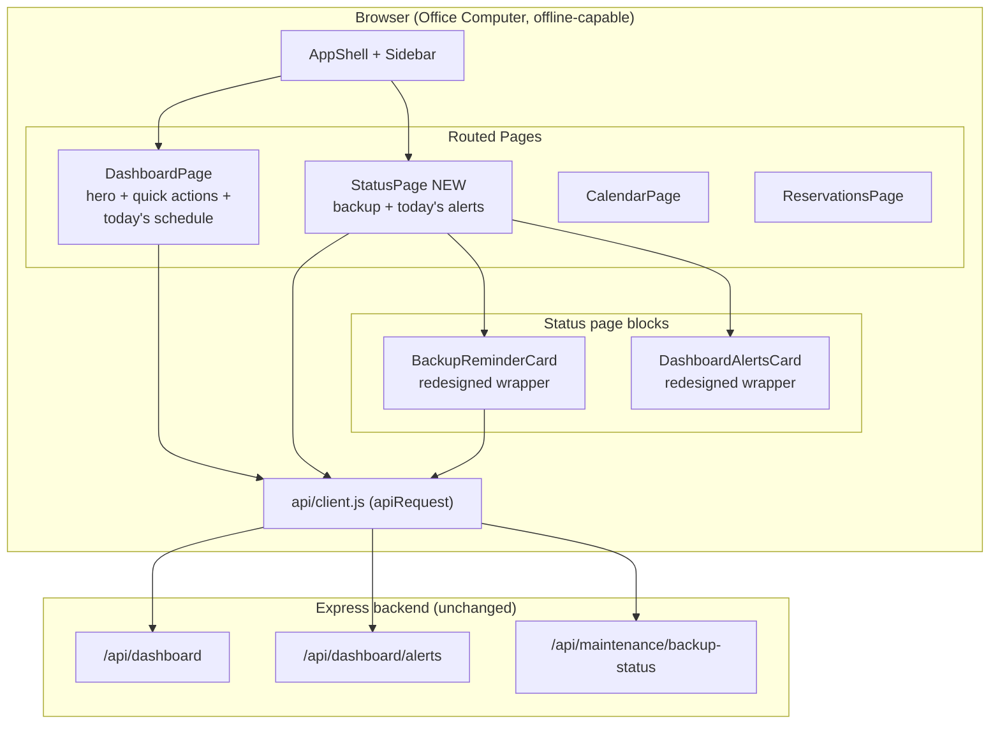
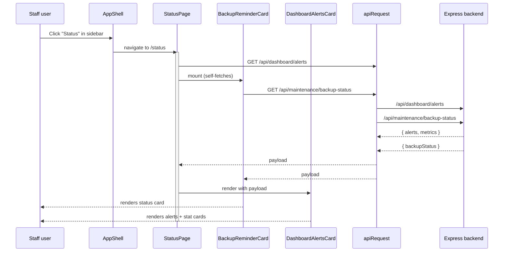
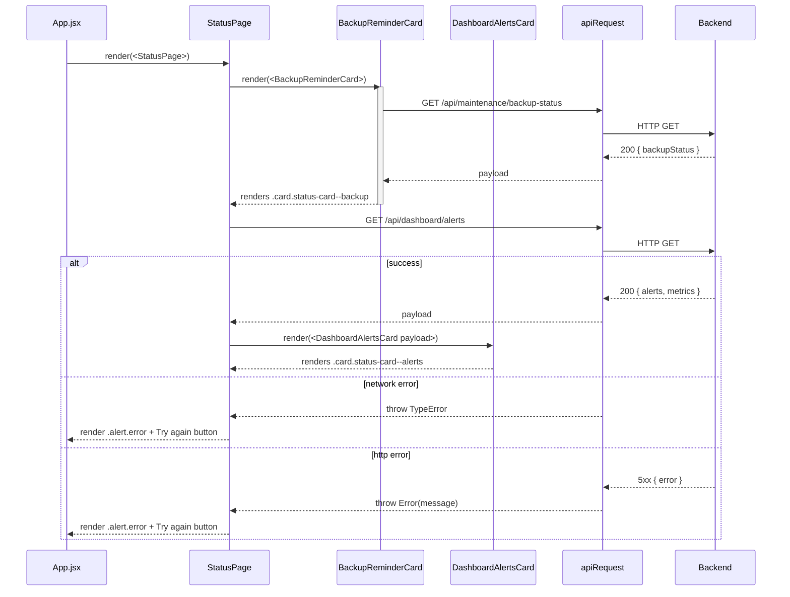

# Design Document: Dashboard Status Page

## Overview

Move the `BackupReminderCard`, the `DashboardAlertsCard` (today's alerts list, "Reservations today" stat card, "Missed, still pending" stat card, next-reservation banner, public-use / maintenance notices), and the alerts-fetch error band off the dashboard and onto a new dedicated **Status page** at `/status`. The Status page consolidates "what needs attention right now" in one location, redesigned so the backup-notice and today's-alerts blocks match the rest of the Barangay Court Scheduler staff console (white bordered `.card` containers, `Instrument Serif` section titles with italic Tagalog `.fil` subtitles, the `--primary` / `--accent` / `--ink-muted` palette already declared in `client/src/styles.css`).

The dashboard becomes a focused **landing page**: official greeting, quick actions, nearest-available banner, and today's schedule list. Nothing is removed from the system — the alerts payload, backup-status payload, reservation-today count, missed-pending count, and admin actions all stay reachable via the new `/status` route. Existing data sources (`GET /api/dashboard`, `GET /api/dashboard/alerts`, `GET /api/maintenance/backup-status`) and existing fetch logic in `BackupReminderCard.jsx` and `DashboardAlertsCard.jsx` are unchanged; only the location, the wrapper layout, and a thin visual refresh layered on the existing CSS tokens are touched.

No new design tokens, no new fonts, no new color families, no new icon set, no backend route changes, no payload-shape changes. The existing component vocabulary (`AppShell`, `EmptyState`, `LoadingState`, `Icon`, `StatusBadge`, `.card`, `.card-head`, `.card-title`, `.padded-card`, `.stat-card`, `.alert.warning`, `.alert.error`, `.alert.info`, `.detail-grid`, `.info-banner`) carries the entire redesign.

## Steering Documents Reviewed

- `.kiro/specs/post-deployment-frontend/design.md` — original definitions of `DashboardAlertsCard`, `BackupReminderCard`, and `TodaySnapshotCard`, plus the `/api/dashboard/alerts` and `/api/maintenance/backup-status` payload shapes. The Status page reuses those payload shapes verbatim.
- `.kiro/specs/ui-audit-remediation/design.md` — current Barangay visual language (`--bg`, `--surface`, `--surface-2`, `--border`, `--ink`, `--ink-muted`, `--radius: 10px`, `--radius-lg: 14px`, `--shadow*`, the spacing scale `--space-xs`..`--space-xl`, the Civic Blue + Court Orange palette, the `.card` / `.card-head` / `.card-title` / `.fil` rules, the `.alert.warning` / `.alert.error` / `.alert.info` rules, the `Instrument Serif` 26px section heading + italic Tagalog `.fil` subtitle pattern). The Status page introduces no new tokens; every selector is a reuse of these.
- `client/src/styles.css` (the actual token vocabulary in use) — all card, stat-card, alert, detail-grid, page-head, staff-page-head, page-title, page-sub, and page-sub-fil rules consumed by this page.
- `client/src/pages/DashboardPage.jsx` — the surface losing the two blocks.
- `client/src/components/AppShell.jsx` — the `NAV_GROUPS[].items` registry that gains a "Status" entry.

## Goals Mapping

| Goal | Design element |
| --- | --- |
| Create a new Status page that consolidates the backup status panel, today's alerts, and the reservation/missed stat cards | New `client/src/pages/StatusPage.jsx`, new route `/status`, new `Operate` nav entry — see §"Architecture" and §"Routing and Navigation" |
| Redesign the backup-due panel and today's alerts section so they visually match the rest of the program (typography, color, spacing, card styling, bilingual labels) | Existing `.card` + serif `.card-title` + italic `.fil` subtitle pattern applied to both blocks; `BackupReminderCard` rewritten to render inside a `.card` wrapper; `DashboardAlertsCard` rewritten to use a structured 2-up stat grid — see §"Components and Interfaces" and §"Styling Spec" |
| Define what the dashboard becomes after these blocks are removed | `DashboardPage` becomes hero + quick actions + nearest-available banner + today's schedule list, with a one-line "Open the Status page for alerts and backup notices" linking action — see §"DashboardPage residual layout" |
| Preserve existing data sources and actions (backup reminder logic, alerts logic, reservation counters, missed-list counter) | All fetch calls, payload unwrap logic, palette selection, and console-error branches in `BackupReminderCard.jsx` and `DashboardPage.jsx` move verbatim into `StatusPage.jsx` and the redesigned cards — see §"Data Flow" and §"Components and Interfaces" |

---

# Part 1 — High-Level Design

## Architecture

### System diagram



### Page / component structure

```
client/src/
├── App.jsx                                  ── ADD `/status` route to renderPage()
├── components/
│   ├── AppShell.jsx                         ── ADD `Status` entry to NAV_GROUPS[0].items
│   ├── BackupReminderCard.jsx               ── REWRAP in .card; render calm "Up to date" state
│   │                                            when backupDue !== true (instead of returning null)
│   └── DashboardAlertsCard.jsx              ── REWRAP stat rows in a .status-stat-grid;
│                                            ── pull next-reservation up beside the headline
├── pages/
│   ├── DashboardPage.jsx                    ── REMOVE BackupReminderCard mount,
│   │                                            DashboardAlertsCard mount,
│   │                                            and the alerts-fetch state + retry UI
│   └── StatusPage.jsx                       ── NEW (owns the alerts fetch + retry + error band)
└── styles.css                               ── ADD .status-page, .status-stat-grid,
                                                 .status-section selectors that compose
                                                 existing tokens (no new tokens introduced)
```

### Data flow



The alerts fetch lives on `StatusPage` (lifted from `DashboardPage`). The backup-status fetch stays inside `BackupReminderCard` (it already self-fetches and self-errors per `client/src/components/BackupReminderCard.jsx` lines 73–95). Both endpoints, both payload shapes, and both unwrap-and-error patterns are unchanged. The dashboard no longer fires either request.

## Routing and Navigation

A single new path is introduced:

| Path | Page | Nav group | Notes |
|---|---|---|---|
| `/status` | `StatusPage` | `Operate` | New page; sits between `Calendar` and `New Reservation` so "Status" reads next to "Home" in the daily-use list. |

`AppShell.NAV_GROUPS[0].items` (the `Operate` group) gains:

```js
{ path: "/status", label: "Status", helper: "Alerts and backup", icon: "info" }
```

The icon `info` is already in the `Icon` component's name set (used by the existing Court Policy entry). No new icon is added.

`App.jsx#renderPage` gains one branch above the dashboard catch-all:

```js
if (path === "/status") return <StatusPage onNavigate={navigate} user={user} />;
```

The existing `if (path.startsWith("/dashboard")) return <DashboardPage ... />;` branch stays unchanged. No deep-link sub-paths under `/status` are introduced (this matches the Court Policy / Resident Directory pattern of single-screen pages).

## DashboardPage residual layout

After the two blocks move out, `DashboardPage` renders, top to bottom:

1. `staff-page-head` with the existing serif "Today" page-title, the formatted date, and the italic Tagalog `Ngayong araw` subtitle. _Unchanged._
2. `New Reservation` `btn-big` primary action. _Unchanged._
3. The dashboard fetch error band (only rendered when `dashboardState.error` is set). _Unchanged._
4. `home-hero` (greeting card + quick-action stack). _Unchanged._
5. The nearest-available `info-banner`. _Unchanged._
6. `Today's Schedule` `.card` with the booked-slot list. _Unchanged._

What disappears from the dashboard:

- The `<BackupReminderCard />` mount.
- The alerts error band + "Try again" button.
- The `<DashboardAlertsCard payload={...} />` mount.
- The `alertsState`, `alertsRetry`, and the second `useEffect` that fetches `/api/dashboard/alerts`.

A small **discoverability hint** (one line of helper copy, no new component) is appended inside the existing `home-hero` `.hero-card` so staff who used to scan the dashboard for alerts know where the content moved:

```
That's 4 hours of court time today.
3 open slots still available for staff encoding.
Open the Status page for alerts and backup notices.   ← NEW line
```

The line is plain text inside the existing `.hero-note`. No new selector, no new component. Once staff learn the new location, this single line is both the wayfinding and the only redirect needed.

## Status page composition

`StatusPage` renders, top to bottom, on a single column:

1. `staff-page-head` with serif page title `Status` and italic Tagalog `Estado` subtitle, plus the existing `page-sub` "Today's alerts and backup reminders" line — same `page-head` / `page-title` / `page-sub` / `page-sub-fil` chain the dashboard uses.
2. **Backup status section** — `<BackupReminderCard />` (redesigned wrapper, see §Low-Level Design).
3. **Today's alerts section** — alerts fetch error band (when set), then `<DashboardAlertsCard payload={...} />` (redesigned wrapper). The error band uses the existing `.alert.error` rule with the same "Try again" button copy as today's dashboard.

Both blocks sit inside a common page wrapper `.status-page` that lays them out in a vertical stack with `gap: var(--space-lg)` (already used by `.page-stack` and `.page` in `styles.css`). The page introduces zero new typography weights, zero new fonts, zero new colors, and zero new shadows.

## Components and Interfaces

The Status page introduces one new page component and reuses two existing components (with their internal layouts redesigned to match the program's existing design language). Detailed signatures, props, state, and styling tokens for each block live in §"Part 2 — Low-Level Design"; this section gives the high-level interface summary.

### `StatusPage` (NEW — `client/src/pages/StatusPage.jsx`)

Owns the `/api/dashboard/alerts` fetch (lifted from `DashboardPage`), the retry counter, and the page chrome (`.staff-page-head`, page title, page sub, page sub fil).

```ts
interface StatusPageProps {
  onNavigate: (path: string) => void;   // reserved for future cross-links
  user: { role: "ADMIN" | "STAFF"; fullName: string };
}
```

**Responsibilities**:

- Render the page heading (serif "Status" title + italic Tagalog "Estado" subtitle).
- Mount `<BackupReminderCard />`.
- Fetch `/api/dashboard/alerts`; on success, render `<DashboardAlertsCard payload={...} />`; on error, render the standard `.alert.error` band with a "Try again" button.
- Render `<LoadingState>` while the alerts request is in flight on first mount.

### `BackupReminderCard` (REDESIGNED — same path, same `props: () => never`)

Self-fetches `/api/maintenance/backup-status` (logic unchanged). Renders inside a `.card` container with `.card-head` + serif `.card-title` + italic `.fil` Tagalog subtitle, the existing `.detail-grid` for the three labeled rows, and an actionable `.alert.warning` / `.alert.error` stripe when `backupDue === true`. When `backupDue !== true`, renders a calm "Up to date" body inside the same `.card` container instead of returning `null` (the dashboard no longer mounts the card, so this expansion does not affect dashboard quietness).

### `DashboardAlertsCard` (REDESIGNED — same path, same prop)

```ts
interface DashboardAlertsCardProps {
  payload: DashboardAlerts;
}
```

Pure renderer (no fetch, no state). Renders inside a `.card` container with `.card-head` + serif `.card-title` + italic `.fil` Tagalog subtitle ("Today's alerts" / "Mga babala ngayong araw"). Body wraps in `.padded-card`; the next-reservation `info-banner` moves above the stat grid; the two stat cards (`Reservations today`, `Missed, still pending`) sit side-by-side in a 2-up `.status-stat-grid` that collapses to one column under 640px; alerts list and the public-use / maintenance notices follow.

### Reused components (unchanged)

- `EmptyState` — calm "Nothing needs attention today" body inside the alerts card.
- `LoadingState` — first-mount placeholder while `/api/dashboard/alerts` is in flight.
- `Icon` — `info` glyph on the new "Status" sidebar entry.
- `apiRequest` — both endpoints continue to flow through the existing HTTP client.

### Existing components updated

- `AppShell` — `NAV_GROUPS[0].items` gains a `Status` entry (`/status`, icon `info`, helper "Alerts and backup").
- `App.jsx` `renderPage` — gains an `if (path === "/status") return <StatusPage … />` branch.
- `DashboardPage` — loses the two block mounts, the alerts fetch effect, and the `alertsState` / `alertsRetry` state; gains one wayfinding line inside `.hero-note`.

## Data Models

All payload types are mirrored verbatim from the existing post-deployment-frontend design (`/api/dashboard/alerts` and `/api/maintenance/backup-status`). The Status page does not reshape, rename, or extend any field.

```ts
type DashboardAlerts = {
  alerts: Array<{ id: string; severity: "info"|"warning"|"danger"; title?: string; body?: string; message?: string }>;
  metrics: {
    todayReservationCount: number;
    missedPendingCount: number;
    nextReservation: { startTime: string; representativeName: string; referenceNo: string } | null;
    publicUseActiveToday: boolean;
    maintenanceActiveToday: boolean;
    backupStatus?: BackupStatus;
  };
};

type BackupStatus = {
  lastBackupAt: string | null;
  daysSinceBackup: number | null;
  reminderThresholdDays: number;
  backupDue: boolean;
};
```

## Error Handling

The Status page reuses the existing two-message convention defined by `apiRequest`:

- **Network failure (no HTTP status on the thrown `Error`)**: render the standard office-friendly offline copy `"The system is offline or the office network is down. Try again once the network is back."` inside an `.alert.error` band.
- **HTTP 4xx / 5xx**: render the backend `error` message verbatim inside an `.alert.error` band.

Per-block behavior:

| Block | Error behavior |
|---|---|
| Today's alerts (`/api/dashboard/alerts`) | Error band rendered above the alerts card with a "Try again" `btn-light btn-small` that increments a retry counter to re-fire the fetch (lifted verbatim from today's `DashboardPage`). The alerts-card itself unmounts when `payload === null` so no stale data is shown. |
| Backup status (`/api/maintenance/backup-status`) | Existing behavior preserved: on error, `BackupReminderCard` `console.error`s and renders nothing. The Status page does **not** wrap the backup card in an extra error band — the card is self-contained, just like on the old dashboard. |

If both endpoints fail simultaneously, the page still renders the `staff-page-head` and the alerts error band; the backup card is silently absent. The page never throws an uncaught render exception or shows a blank panel.

## Testing Strategy

### Applicability of property-based testing

The Status page is pure UI rendering, route registration, and prop wiring. The post-deployment-frontend spec already documented that this surface family ("dashboard alerts surface", "backup reminder render when backupDue") is covered by example-based and source-level assertions, not property-based tests. That conclusion still applies: there is no algorithmic transformation, no input space large enough to merit a generator, and the existing `tests/reactFrontendStatic.test.js` style is the project convention.

## Correctness Properties

The structural invariants below are enforced by the static-source assertions described in §"Testing Strategy". Generator-based testing does not apply to these UI rendering surfaces because there is no algorithmic transformation over a meaningful input space.

### Property 1: DashboardPage drops the moved blocks

For every build of the staff console, the source of `client/src/pages/DashboardPage.jsx` does not import `BackupReminderCard`, does not import `DashboardAlertsCard`, and does not call `apiRequest("/api/dashboard/alerts")`.

**Validates: Requirements 1.1, 1.2** (to be derived from this design — placeholder pending the requirements phase of the design-first workflow).

### Property 2: StatusPage owns the alerts fetch and mounts both redesigned blocks

For every build of the staff console, the source of `client/src/pages/StatusPage.jsx` exports `StatusPage`, imports both `BackupReminderCard` and `DashboardAlertsCard`, and contains exactly one `apiRequest("/api/dashboard/alerts")` call.

**Validates: Requirements 1.3, 2.1** (to be derived).

### Property 3: Redesigned cards introduce no new design tokens

For every build of `client/src/styles.css`, the additions for `.status-page`, `.status-stat-grid`, `.status-alerts-list`, `.status-card-calm`, and `.status-next-reservation` reference only existing CSS custom properties. No new `--<token>:` declaration appears inside the Status block.

**Validates: Requirements 3.1, 3.2** (to be derived).

### Test layers

1. **Static-source assertions** (existing pattern from `tests/reactFrontendStatic.test.js`): the new test file or extension asserts the source files contain / do not contain specific strings.
2. **Behavioral example tests**: a minimal jsdom render check verifying that `StatusPage` fetches `/api/dashboard/alerts`, mounts `BackupReminderCard`, and surfaces error / retry / empty states correctly; and that `DashboardPage` no longer fetches `/api/dashboard/alerts`, no longer mounts `BackupReminderCard`, and no longer mounts `DashboardAlertsCard`.

### Specific assertions

- `client/src/pages/DashboardPage.jsx` does **not** import `BackupReminderCard` or `DashboardAlertsCard`, and does **not** call `apiRequest("/api/dashboard/alerts")`.
- `client/src/pages/StatusPage.jsx` exists, exports `StatusPage`, imports `BackupReminderCard` and `DashboardAlertsCard`, and calls `apiRequest("/api/dashboard/alerts")`.
- `client/src/App.jsx` `renderPage` returns `<StatusPage>` for `path === "/status"`.
- `client/src/components/AppShell.jsx` `NAV_GROUPS[0].items` contains an entry with `path: "/status"` and `label: "Status"`.
- `client/src/components/BackupReminderCard.jsx` renders inside a `.card` wrapper (asserted by string match `className="card status-card status-card--backup"` or equivalent class chain).
- `client/src/components/DashboardAlertsCard.jsx` renders inside a `.card` wrapper with `class="card-title"` and the existing `.fil` italic Tagalog subtitle string `Mga babala ngayong araw`.
- `client/src/styles.css` contains the new `.status-page`, `.status-stat-grid`, `.status-section` selectors and references **only** existing CSS variables (no new `--*` tokens introduced; verified by a regex assertion that no new `--` declarations appear inside the Status block).
- The dashboard's `home-hero` `.hero-note` block contains the new "Open the Status page for alerts and backup notices" wayfinding line.

### Build and verification

- `npm run frontend:build` continues to build successfully.
- `node scripts/run-tests.mjs` runs the new and existing tests.
- `node scripts/verify-react-build.mjs` continues to pass.
- Backend route handlers, database schema, server-side validation, and deployment scripts remain untouched.

## Performance Considerations

- The Status page fires the same two fetches the dashboard previously fired, only on a different route. Net request volume per session is unchanged.
- The dashboard sheds two fetches per visit, so its cold-load time decreases marginally. No measurement-blocking work is added.

## Security Considerations

- No authentication, authorization, or session-handling is changed. The `/status` route is rendered inside `AppShell`, which already guards all non-print, non-login routes behind a successful `getSession()` call (see `App.jsx`).
- No new input is collected from the user; both blocks are read-only displays.
- No outbound network resources are introduced. All fonts, icons, and CSS continue to be served from `client/public/app/`.

## Dependencies

None added. The page reuses:

- `react` (already a dependency)
- `client/src/api/client.js` `apiRequest` (already used)
- `client/src/api/mappers.js` `formatBackendDateTime`, `formatTime`, `formatDate` (already used)
- `client/src/api/referenceNo.js` `formatReferenceNo` (already used by the alerts card)
- `client/src/components/{EmptyState,Icon,LoadingState,BackupReminderCard,DashboardAlertsCard}.jsx` (already exist)

---

# Part 2 — Low-Level Design

## Component Signatures

### `StatusPage` (NEW)

```jsx
// client/src/pages/StatusPage.jsx

import { useEffect, useState } from "react";
import { apiRequest } from "../api/client.js";
import { BackupReminderCard } from "../components/BackupReminderCard.jsx";
import { DashboardAlertsCard } from "../components/DashboardAlertsCard.jsx";
import { LoadingState } from "../components/LoadingState.jsx";

const OFFLINE_MESSAGE =
  "The system is offline or the office network is down. Try again once the network is back.";

/**
 * Status page.
 *
 * Single-column page that consolidates the backup-status reminder and
 * the today's-alerts panel that used to live on the dashboard. The
 * dashboard now focuses on the day's schedule and quick actions; this
 * page collects every "needs attention right now" signal in one place.
 *
 * Both blocks reuse their existing components verbatim:
 *   - <BackupReminderCard /> self-fetches /api/maintenance/backup-status
 *     and self-errors via console.error if the request fails.
 *   - <DashboardAlertsCard payload={...} /> is a pure renderer; the
 *     alerts payload is fetched here from /api/dashboard/alerts and
 *     passed in as a prop. A "Try again" button increments
 *     `alertsRetry` to re-fire the fetch (lifted from DashboardPage).
 *
 * Network failures (where fetch() throws without an HTTP status) render
 * the standard office-friendly offline copy; HTTP 4xx and 5xx render the
 * backend `error` message verbatim through `apiRequest`.
 */
export function StatusPage({ onNavigate, user }) {
  const [alertsState, setAlertsState] = useState({
    loading: true,
    payload: null,
    error: ""
  });
  const [alertsRetry, setAlertsRetry] = useState(0);

  useEffect(() => {
    let active = true;
    setAlertsState((previous) =>
      previous.loading && previous.payload === null && previous.error === ""
        ? previous
        : { loading: true, payload: null, error: "" }
    );
    apiRequest("/api/dashboard/alerts")
      .then((payload) => {
        if (!active) return;
        setAlertsState({ loading: false, payload, error: "" });
      })
      .catch((error) => {
        if (!active) return;
        const message = isNetworkError(error) ? OFFLINE_MESSAGE : error.message;
        setAlertsState({ loading: false, payload: null, error: message });
      });
    return () => { active = false; };
  }, [alertsRetry]);

  return (
    <section className="page status-page">
      <div className="page-head staff-page-head">
        <div>
          <h1 className="page-title">Status</h1>
          <div className="page-sub">Today's alerts and backup reminders</div>
          <div className="page-sub-fil">Estado ng sistema</div>
        </div>
      </div>

      <BackupReminderCard />

      {alertsState.error && (
        <div className="alert error" role="alert">
          <span>{alertsState.error}</span>
          <button
            type="button"
            className="btn btn-light btn-small"
            onClick={() => setAlertsRetry((count) => count + 1)}
          >
            Try again
          </button>
        </div>
      )}
      {alertsState.loading && !alertsState.payload && (
        <LoadingState label="Loading today's alerts..." />
      )}
      {alertsState.payload && <DashboardAlertsCard payload={alertsState.payload} />}
    </section>
  );
}

function isNetworkError(error) {
  if (!error) return false;
  if (error.name === "TypeError" && typeof error.status === "undefined") return true;
  if (error.message === "Failed to fetch") return true;
  if (error.message === "Network request failed") return true;
  return false;
}
```

**Props**:

| Name | Type | Required | Description |
|---|---|---|---|
| `onNavigate` | `(path: string) => void` | yes | Reserved for future cross-links (e.g., "Go to Calendar"); not used by the initial render but accepted for consistency with the other page components. |
| `user` | `{ role: "ADMIN" \| "STAFF", fullName: string }` | yes | Reserved for future role-gated content on the Status page; not used by the initial render. |

**State**:

| Name | Shape | Lifetime | Description |
|---|---|---|---|
| `alertsState` | `{ loading: boolean, payload: DashboardAlerts \| null, error: string }` | mount → unmount | Mirrors the existing `DashboardPage` `alertsState`; lifted verbatim. |
| `alertsRetry` | `number` | mount → unmount | Bumped by the "Try again" button to re-fire the alerts fetch effect. |

### `BackupReminderCard` (REDESIGNED, signature unchanged)

The component name, file path, and props are unchanged. The internals are restructured so the rendered tree wraps in a `.card` container with the program's standard `.card-head` + serif `.card-title` + italic `.fil` subtitle, the existing `.detail-grid` for the three labeled rows, and the existing `.alert.warning` / `.alert.error` palette rules for the actionable status stripe.

```jsx
// client/src/components/BackupReminderCard.jsx (excerpt — internals only)

export function BackupReminderCard() {
  const [status, setStatus] = useState(null);
  const [hidden, setHidden] = useState(false);

  // Fetch logic, unwrap rule (`data?.backupStatus || data || {}`),
  // and console.error branch are UNCHANGED. See lines 73-95 of the
  // current file.

  if (hidden) return null;
  if (!status) return null;

  const reminderThresholdDays = numberOrNull(status.reminderThresholdDays);
  const daysSinceBackup = numberOrNull(status.daysSinceBackup);
  const isDue = status.backupDue === true;
  const palette = isDue ? paletteFor(daysSinceBackup, reminderThresholdDays) : "calm";

  return (
    <section
      className={`card status-card status-card--backup status-card--${palette}`}
      aria-labelledby="status-backup-heading"
    >
      <div className="card-head">
        <div>
          <h2 id="status-backup-heading" className="card-title">
            Backup status
            <span className="fil">Estado ng backup</span>
          </h2>
        </div>
        {isDue && (
          <span className={`status-badge status-${palette}`}>
            {palette === "danger" ? "Overdue" : "Due"}
          </span>
        )}
      </div>

      <div className="padded-card">
        <dl className="detail-grid status-detail-grid">
          <div>
            <dt>Last backup</dt>
            <dd>{formatBackendDateTime(status.lastBackupAt)}</dd>
          </div>
          <div>
            <dt>Days since backup</dt>
            <dd>{daysSinceBackup === null ? "Not available" : daysSinceBackup}</dd>
          </div>
          <div>
            <dt>Reminder threshold</dt>
            <dd>
              {reminderThresholdDays === null
                ? "Not available"
                : `${reminderThresholdDays} day${reminderThresholdDays === 1 ? "" : "s"}`}
            </dd>
          </div>
        </dl>

        {isDue ? (
          <div
            className={`alert ${palette === "danger" ? "error" : "warning"}`}
            role="alert"
            aria-live="polite"
          >
            <strong>{palette === "danger" ? "Backup overdue" : "Backup due"}.</strong>{" "}
            {MAINTENANCE_LAUNCHER_INSTRUCTION}
          </div>
        ) : (
          <p className="status-card-calm">
            <strong>Up to date.</strong> The most recent backup is within the office reminder threshold.
            <span className="fil"> Updated na ang backup.</span>
          </p>
        )}
      </div>
    </section>
  );
}
```

**Behavioral changes vs. today**:

1. The card always renders inside a `.card` container (matches the rest of the staff console).
2. When `backupDue !== true`, the card renders a calm "Up to date" state instead of returning `null`. This matches the new page's purpose: "show me the current backup posture in one place" rather than "hide unless action is required". The dashboard no longer mounts the card, so this addition does not affect dashboard quietness.
3. The actionable warning / overdue stripe uses `.alert.warning` / `.alert.error` already defined in `styles.css` (no new tokens).
4. The instruction copy is unchanged (still `MAINTENANCE_LAUNCHER_INSTRUCTION`); the wording is in lockstep with `STAFF-DAILY-USE.txt`.

**Behavioral preservations**:

- Endpoint: `/api/maintenance/backup-status` (unchanged).
- Unwrap: `data?.backupStatus || data || {}` (unchanged).
- Error branch: `console.error` and silent hide (unchanged).
- Palette logic: `daysSinceBackup > 2 * reminderThresholdDays` ⇒ danger; else warning (unchanged).

### `DashboardAlertsCard` (REDESIGNED, signature unchanged)

The component name, file path, and `payload` prop are unchanged. The rendered tree gains a `.status-stat-grid` wrapper around the two stat cards so they sit side-by-side (matching the program's other 2-up stat grids in `ReportsPage` and `ReservationHistoryPage`), and the next-reservation banner moves above the alerts list so the most actionable single fact is the first thing read.

```jsx
// client/src/components/DashboardAlertsCard.jsx (excerpt — render only)

export function DashboardAlertsCard({ payload }) {
  // Filter, normalize, and isCalm logic UNCHANGED from current file.
  // ...

  return (
    <section
      className="card status-card status-card--alerts"
      aria-labelledby="status-alerts-heading"
    >
      <div className="card-head">
        <div>
          <h2 id="status-alerts-heading" className="card-title">
            Today's alerts
            <span className="fil">Mga babala ngayong araw</span>
          </h2>
        </div>
      </div>

      <div className="padded-card">
        {isCalm ? (
          <EmptyState
            title="Nothing needs attention today"
            body="Walang kailangang aksyunin ngayong araw. Check the calendar if a new request comes in."
          />
        ) : (
          <>
            {hasNextReservation && (
              <div className="info-banner status-next-reservation">
                <strong>Next reservation:</strong>{" "}
                {formatNextReservationTime(nextReservation.startTime)} —{" "}
                {renderText(nextReservation.representativeName)}
              </div>
            )}

            <div className="status-stat-grid">
              <div className="stat-card">
                <span>Reservations today</span>
                <strong>{todayReservationCount}</strong>
                <small>Mga reserbasyon ngayon</small>
              </div>
              <div className="stat-card">
                <span>Missed, still pending</span>
                <strong>{missedPendingCount}</strong>
                <small>Hindi pa naa-update sa missed list</small>
              </div>
            </div>

            {hasAlerts && (
              <div className="status-alerts-list">
                {alerts.map((alert, index) => {
                  const heading = alert.title ? String(alert.title) : "";
                  const detail = alert.body ? String(alert.body) : "";
                  const message = alert.message ? String(alert.message) : "";
                  return (
                    <div
                      key={alertKey(alert, index)}
                      className={`alert ${alertSeverityClass(alert.severity)}`}
                      role="alert"
                    >
                      {heading && <strong>{heading}</strong>}
                      {message && <div>{message}</div>}
                      {detail && <div>{detail}</div>}
                    </div>
                  );
                })}
              </div>
            )}

            {publicUseActiveToday && (
              <div className="alert info" role="status">
                <strong>Cleared for public use today.</strong>{" "}
                The court has been opened for public use for at least part of today.
              </div>
            )}

            {maintenanceActiveToday && (
              <div className="alert warning" role="status">
                <strong>Maintenance active today.</strong>{" "}
                A maintenance or unavailable block is in effect for at least part of today.
              </div>
            )}
          </>
        )}
      </div>
    </section>
  );
}
```

**Behavioral changes vs. today**:

1. Body content moves inside a `.padded-card` wrapper so the heading is separated from content by the program-standard `--space-rhythm` (28px) gutter (matches every other staff card).
2. The two stat cards (`Reservations today`, `Missed, still pending`) are rendered inside a 2-column `.status-stat-grid` instead of stacked. On viewports `< 640px` the grid collapses to a single column.
3. The next-reservation `info-banner` is reordered to sit **above** the stat grid (most actionable fact first); on the dashboard today it sat below.
4. Alerts list is wrapped in a `.status-alerts-list` so multiple alert rows share consistent spacing.
5. The empty state continues to use the program's `<EmptyState>` component (unchanged).

**Behavioral preservations**:

- Payload prop shape (unchanged).
- Filter rule for empty alert objects (unchanged).
- Severity-class mapping (unchanged).
- `isCalm` empty-state gate (unchanged).
- Tagalog labels (`Mga babala ngayong araw`, `Mga reserbasyon ngayon`, `Hindi pa naa-update sa missed list`) (unchanged).

## Updated Existing Components

### `DashboardPage.jsx`

```diff
- import { BackupReminderCard } from "../components/BackupReminderCard.jsx";
- import { DashboardAlertsCard } from "../components/DashboardAlertsCard.jsx";

  export function DashboardPage({ onNavigate, user }) {
    const [dashboardState, setDashboardState] = useState({ loading: true, data: null, error: "" });
-   const [alertsState, setAlertsState] = useState({ loading: true, payload: null, error: "" });
-   const [alertsRetry, setAlertsRetry] = useState(0);

    useEffect(() => { /* unchanged: /api/dashboard fetch */ }, []);

-   useEffect(() => { /* removed: /api/dashboard/alerts fetch */ }, [alertsRetry]);

    // ...

    return (
      <section className="page home-page">
        <div className="page-head staff-page-head"> ... </div>

        {dashboardState.error && (
          <div className="alert error" role="alert">{dashboardState.error}</div>
        )}

-       <BackupReminderCard />
-
-       {alertsState.error && (...)}
-       {alertsState.payload && <DashboardAlertsCard payload={alertsState.payload} />}

        {dashboardData && (
          <>
            <div className="home-hero">
              <div className="hero-card">
                ...
                <div className="hero-note">
                  That's {formatHourCount(totalHours)} of court time today.
                  {hasScheduleSlots && <><br />...</>}
+                 <br />Open the Status page for alerts and backup notices.
                </div>
              </div>
              ...
            </div>
            ...
          </>
        )}
      </section>
    );
  }
```

The `home-hero` greeting card, quick actions, nearest-available banner, and Today's Schedule list are untouched. Only the two block mounts and the alerts fetch are removed; one wayfinding line is added to the `.hero-note`.

### `AppShell.jsx`

```diff
  const NAV_GROUPS = [
    {
      label: "Operate",
      items: [
        { path: "/dashboard", label: "Home", helper: "Today's schedule", icon: "home" },
+       { path: "/status", label: "Status", helper: "Alerts and backup", icon: "info" },
        { path: "/schedule", label: "Calendar", helper: "See the week", icon: "calendar" },
        { path: "/reservations/new", label: "New Reservation", helper: "Encode walk-in", icon: "plus" },
        { path: "/reservations", label: "All Bookings", helper: "Search records", icon: "list" }
      ]
    },
    ...
  ];
```

The new entry sits second in the `Operate` group (after Home, before Calendar). Both Staff_User and Admin_User see the entry — the Status page has no admin-only content, so the existing `adminOnly` flag is omitted.

### `App.jsx`

```diff
  function renderPage(path, navigate, user) {
    if (path === "/account/password") return <AccountPasswordPage user={user} />;
    if (path.startsWith("/account")) return <AccountsPage user={user} />;
    if (path.startsWith("/activity-logs")) return <ActivityLogsPage />;
    if (path.startsWith("/reports")) return <ReportsPage />;
    if (path.startsWith("/residents")) return <ResidentDirectoryPage onNavigate={navigate} />;
    if (path === "/settings/court-policy") return <CourtPolicyPage user={user} onNavigate={navigate} />;
+   if (path === "/status") return <StatusPage onNavigate={navigate} user={user} />;
    if (path === "/reservations/new") return <ReservationFormPage onNavigate={navigate} />;
    if (path === "/reservations/history") return <ReservationHistoryPage onNavigate={navigate} />;
    ...
    if (path.startsWith("/dashboard")) return <DashboardPage onNavigate={navigate} user={user} />;
    ...
  }
```

A matching `import { StatusPage } from "./pages/StatusPage.jsx";` is added at the top, sorted next to the other page imports.

## Styling Spec — block-by-block token mapping

Every selector below is composed from existing `client/src/styles.css` tokens and rules. No new design tokens are introduced.

### Status page wrapper

| Selector | Property | Value | Source |
|---|---|---|---|
| `.status-page` | `display` | `grid` | reuse of `.page` rule |
| `.status-page` | `gap` | `var(--space-lg)` | existing 36px rhythm token |
| `.status-page > .staff-page-head` | _all_ | inherited from `.staff-page-head` | existing rule (lines 3778-3803) |
| `.status-page .page-title` | `font-family` | `var(--font-serif)` | existing `.staff-page-head .page-title` (line 3787) |
| `.status-page .page-title` | `font-size` | `clamp(36px, 5vw, 44px)` | existing `.staff-page-head .page-title` (line 3789) |
| `.status-page .page-sub-fil` | `font-style` | `italic` | existing `.page-sub-fil` (line 3801) |
| `.status-page .page-sub-fil` | `color` | `var(--ink-muted)` | existing `.page-sub` / `.page-sub-fil` (lines 3793-3796) |

### Backup status card (`.status-card--backup`)

| Element | Selector | Token / value | Source |
|---|---|---|---|
| Outer container | `.card.status-card.status-card--backup` | `border: 1px solid var(--border)`; `border-radius: 10px`; `background: var(--surface)` | existing `.card` rule (line 1319) |
| Card heading | `.card-head` | `padding: 16px`; `border-bottom: 1px solid var(--border)`; `background: var(--surface-2)` | existing `.card-head` (line 982) |
| Heading text | `.card-title` | `font-family: var(--font-serif)`; `font-size: 26px`; `font-weight: 400`; `color: var(--ink)` | existing `.card-title` (line 1391) |
| Tagalog subtitle | `.card-title .fil` | `font-style: italic`; `font-size: 14px`; `color: var(--ink-muted)` | existing `.card-title .fil` (line 1398) |
| Heading badge (Due / Overdue) | `.status-badge.status-warning` / `.status-badge.status-danger` | existing `.status-*` chip rules | existing palette (lines 3640+) |
| Body wrapper | `.padded-card` | `padding: 24px`; `display: grid`; `gap: var(--space-rhythm)` | existing `.padded-card` (line 1372) |
| Three-row detail grid | `.detail-grid.status-detail-grid` | `dt` color `var(--ink-muted)`, `font-size: 12px`, `font-weight: 600`; `dd` color `var(--ink)`, `font-weight: 600` | existing `.detail-grid` (lines 1091-1102) |
| Action stripe (Due) | `.alert.warning` | `background: var(--alert-warning-bg)`; `border: 1px solid var(--alert-warning-border)`; `color: var(--alert-warning-text)` | existing `.alert.warning` (line 333) |
| Action stripe (Overdue) | `.alert.error` | `background: var(--alert-error-bg)`; `border: 1px solid var(--alert-error-border)`; `color: var(--danger)` | existing `.alert.error` (line 327) |
| Calm "Up to date" copy | `.status-card-calm` | `color: var(--ink-muted)`; `.fil` continues to render italic via `.card-title .fil` rule (and a small inline `.fil` wrap) | reuses `--ink-muted` and the `.fil` family |

New CSS additions for this block (composed from existing tokens):

```css
/* Status page composition; no new tokens introduced. */
.status-page {
  display: grid;
  gap: var(--space-lg);
}

/* Optional 2-up grid for the stat cards; collapses on narrow viewports. */
.status-stat-grid {
  display: grid;
  grid-template-columns: 1fr 1fr;
  gap: var(--space-md);
}

@media (max-width: 640px) {
  .status-stat-grid {
    grid-template-columns: 1fr;
  }
}

/* Optional vertical rhythm for stacked alert rows inside the alerts card. */
.status-alerts-list {
  display: grid;
  gap: var(--space-sm);
}

/* Calm "Up to date" copy inside the backup card body. */
.status-card-calm {
  margin: 0;
  color: var(--ink-muted);
  font-size: 15px;
  line-height: 1.5;
}

.status-card-calm strong {
  color: var(--ink);
  font-weight: 700;
}

.status-card-calm .fil {
  font-style: italic;
  color: var(--ink-muted);
}

/* Pull next-reservation closer to the headline above the stat grid. */
.status-next-reservation {
  margin-bottom: 0;
}
```

Every value above either references an existing variable or reuses an existing token rule. The block introduces zero new `--*` declarations.

### Today's alerts card (`.status-card--alerts`)

| Element | Selector | Token / value | Source |
|---|---|---|---|
| Outer container | `.card.status-card.status-card--alerts` | `.card` rule | existing (line 1319) |
| Heading | `.card-head` + `.card-title` | serif 26px / italic `.fil` 14px | existing rules |
| Body wrapper | `.padded-card` | 24px padding, `--space-rhythm` gap | existing |
| Next-reservation banner | `.info-banner.status-next-reservation` | `background: var(--primary-softer)`; `color: var(--ink-2)`; existing chip layout | existing `.info-banner` (line 1357) |
| Stat cards | `.stat-card` | white bordered card; serif `strong` 40px; italic-friendly small caption | existing `.stat-card` (lines 1324-1347) |
| Stat-card label | `.stat-card span` | `color: var(--ink-muted)`; `font-size: 13px`; `font-weight: 600`; `text-transform: uppercase` | existing rule (line 1330) |
| Stat-card number | `.stat-card strong` | `color: var(--primary-dark)`; `font-size: 40px` | existing rule (line 1337) |
| Stat-card caption | `.stat-card small` | `color: var(--ink-muted)`; `font-size: 14px`; `font-weight: 700` | existing rule (line 1343) |
| Alerts list rows | `.status-alerts-list .alert.{info,warning,error}` | existing alert palettes | existing |
| Public-use notice | `.alert.info` | `background: var(--primary-soft)`; `border: 1px solid var(--info-border)` | existing (line 347) |
| Maintenance notice | `.alert.warning` | as above | existing (line 333) |
| Empty state | `<EmptyState>` | unchanged | existing component |

The Tagalog `.fil` subtitle on `Today's alerts` (`Mga babala ngayong araw`) and the Tagalog small captions on each `.stat-card` (`Mga reserbasyon ngayon`, `Hindi pa naa-update sa missed list`) are preserved verbatim from the current `DashboardAlertsCard`.

## Bilingual labels — final copy

| Position | English | Tagalog | Selector |
|---|---|---|---|
| Status page title | Status | Estado | `.staff-page-head .page-title` + `.page-sub-fil` |
| Status page subtitle | Today's alerts and backup reminders | (omitted; `.page-sub-fil` carries `Estado`) | `.page-sub` |
| Backup card title | Backup status | Estado ng backup | `.card-title` + `.fil` |
| Backup card calm body | Up to date. The most recent backup is within the office reminder threshold. | Updated na ang backup. | `.status-card-calm` + `.fil` |
| Backup card due stripe | Backup due. Run a backup from the maintenance launcher option … | _(unchanged from current copy; English-only on the action stripe to match the existing `STAFF-DAILY-USE.txt` instruction)_ | `.alert.warning` |
| Alerts card title | Today's alerts | Mga babala ngayong araw | `.card-title` + `.fil` |
| Reservations-today caption | Reservations today | Mga reserbasyon ngayon | `.stat-card span` + `.stat-card small` |
| Missed-pending caption | Missed, still pending | Hindi pa naa-update sa missed list | `.stat-card span` + `.stat-card small` |
| Empty state | Nothing needs attention today | Walang kailangang aksyunin ngayong araw. | `<EmptyState>` |

## Sequence diagram — Status page mount



## Migration / rollout

1. Add `StatusPage.jsx`, register the route in `App.jsx`, and add the nav entry in `AppShell.jsx`.
2. Update `BackupReminderCard.jsx` and `DashboardAlertsCard.jsx` to the redesigned wrappers (new outer `.card`, new internal grid layout). No prop or fetch-shape changes.
3. Remove the two block mounts and the `alertsState` / `alertsRetry` state from `DashboardPage.jsx`. Add the wayfinding line in `.hero-note`.
4. Add the new selectors to `client/src/styles.css` (only the small set listed in §"Styling Spec"; no new variables).
5. Update `tests/reactFrontendStatic.test.js` (or add a focused new file) with the assertions enumerated in §"Testing Strategy".
6. Run `npm run frontend:build`, `node scripts/run-tests.mjs`, and `node scripts/verify-react-build.mjs`.

The change is fully reversible: reverting the file edits restores the previous dashboard composition without any data migration, schema change, or backend impact.
