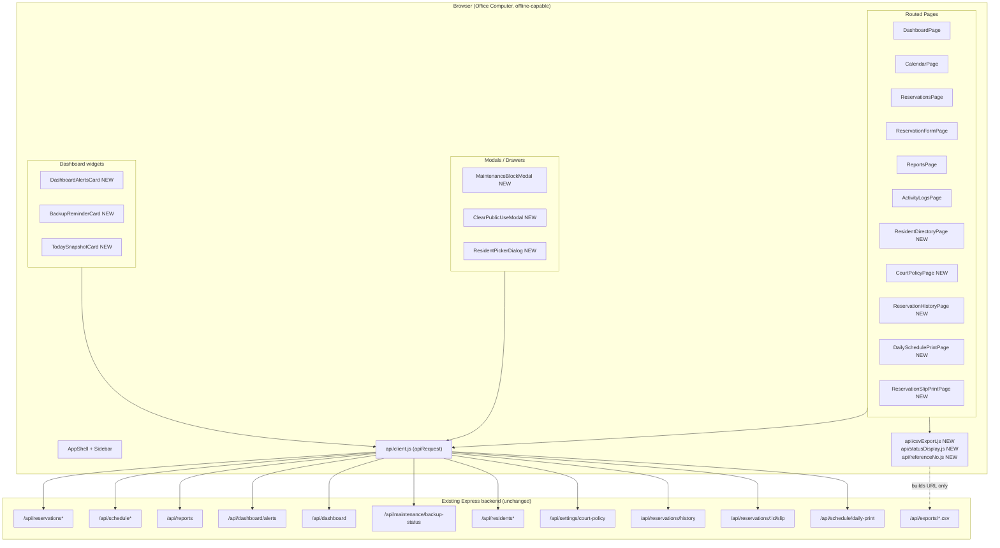

# Design Document

## Overview

This design extends the existing React + Vite staff console at `client/src/` so that every backend capability shipped in the post-deployment release is reachable through the office UI without leaving the Barangay Sto. Niño visual language. The work is purely additive: the existing `apiRequest` client, the routed `App.jsx` shell, the established component set (`Field`, `StatusBadge`, `ConfirmDialog`, `ReservationDetailDrawer`, `EmptyState`, `LoadingState`, `Icon`, `AppShell`), and the existing CSS class vocabulary in `client/src/styles.css` are reused throughout. No backend route handlers, database schema, server-side validation, or deployment scripts are modified.

The feature touches eleven concrete user-facing concerns across nine screens:

1. Reservation reference numbers across every reservation surface (Req. 1).
2. A printable reservation slip (Req. 2).
3. A court policy settings page with role-aware editability (Req. 3).
4. Maintenance / unavailable Schedule_Block management (Req. 4).
5. An expanded reports page wired to the new `/api/reports` sections (Req. 5).
6. CSV-only export controls across schedule, activity logs, missed/cancelled, and reports (Req. 6, Req. 15).
7. A daily-schedule print view (Req. 7).
8. Reservation history lookup by contact number or name (Req. 8).
9. A lightweight resident directory with prefill into the reservation form (Req. 9).
10. Calendar status and block indicators with status-by-label-and-color (Req. 10).
11. Dashboard alerts, today's snapshot, and a non-disruptive backup-reminder widget (Req. 11, Req. 12).
12. Flexible Clear for Public Use with the `WHOLE_DAY` / `TIME_RANGE` / `FROM_TIME_ONWARD` modes (Req. 13).

Cross-cutting concerns: recurring-reservation deferral (Req. 14), CSV-only export labelling (Req. 15), role-based visibility (Req. 16), readable error and empty states (Req. 17), Barangay visual consistency (Req. 18), strict offline operation with no external hosts (Req. 19), test coverage (Req. 20), documentation updates (Req. 21), and build/verification stability (Req. 22).

### Source-of-Truth Documents

- API contract: `docs/POST_DEPLOYMENT_API_CONTRACT.md`
- Handoff: `docs/OPUS_FRONTEND_HANDOFF.md`
- Visual language: `DESIGN.md`, `.impeccable/design.json`, `Barangay (1)/DESIGN.md`
- Existing offline rules: `tests/reactFrontendStatic.test.js`, `scripts/verify-react-build.mjs`

### Non-Goals

- No PDF or XLSX exports of any kind, on the client or via new client-side libraries (Req. 15).
- No recurring-reservation creation flow (Req. 14).
- No frontend-only `clearedDays` / `promptClearDay` / `clearDay` behavior (Req. 13.9, Req. 13.11).
- No new color tokens, gradients, glassmorphism, or generic admin-dashboard / SaaS template styling (Req. 18).
- No outbound network resources at runtime (Req. 19).

## Architecture

### High-Level Diagram



### Routing

The existing `App.jsx` `renderPage` switch is extended with new paths. All paths remain client-side routed via `window.history.pushState` to preserve the offline single-bundle deployment.

| Path | Page | Notes |
|---|---|---|
| `/dashboard` | `DashboardPage` (extended) | Renders `DashboardAlertsCard`, `TodaySnapshotCard`, `BackupReminderCard`. |
| `/schedule` | `CalendarPage` (extended) | Renders new status colors + labels and block payloads. |
| `/schedule/daily-print` | `DailySchedulePrintPage` (NEW) | Print-only view fetching `/api/schedule/daily-print?date=…`. |
| `/reservations` | `ReservationsPage` (extended) | Search includes `referenceNo`; row + drawer show `referenceNo`; print-slip action. |
| `/reservations/:id/slip` | `ReservationSlipPrintPage` (NEW) | Print-only view fetching `/api/reservations/:id/slip`. |
| `/reservations/history` | `ReservationHistoryPage` (NEW) | Lookup by `contactNumber` or `name`. |
| `/residents` | `ResidentDirectoryPage` (NEW) | List, create, edit residents; "Use" action returns to reservation form prefilled. |
| `/reports` | `ReportsPage` (extended) | Renders all expanded sections; CSV export action. |
| `/activity-logs` | `ActivityLogsPage` (extended) | CSV export action with filter params. |
| `/settings/court-policy` | `CourtPolicyPage` (NEW) | Read-only for Staff_User; editable for Admin_User. |

Sidebar entries that are admin-only (court policy editor entry, account management) are hidden via `NAV_ITEMS[].adminOnly`, the existing pattern in `AppShell`.

### Component Layering

Three small helper modules localize logic that would otherwise be duplicated across pages and that map cleanly onto pure functions:

- `client/src/api/csvExport.js` — `buildCsvExportUrl(endpoint, params)` returns a path string with only defined, non-empty filter params appended. Used by every CSV button.
- `client/src/api/statusDisplay.js` — `getStatusDisplay(statusCode, statusName)` returns `{ label, className, paletteKey }`. Used by calendar cells, badges, slip mark, and daily print.
- `client/src/api/referenceNo.js` — `formatReferenceNo(value)` returns the backend string verbatim or `"No reference number"` when missing; `matchesReferenceNo(reservation, query)` performs case-insensitive substring matching used by reservation list filtering.

These helpers are pure, deterministic, and the natural targets for property tests within Requirement 20's static-source style.

### Print Routing

Slip and daily print views render in a dedicated print layout (no `AppShell` chrome) and call `window.print()` once data has loaded successfully. They render `<ErrorState>` instead of an empty print frame on error and never render a blank panel before data loads (Req. 17.5).

## Components and Interfaces

### Existing Components Reused (Req. 18.1)

`Field`, `StatusBadge`, `ConfirmDialog`, `ReservationDetailDrawer`, `EmptyState`, `LoadingState`, `Icon`, `AppShell` are reused without restyling. Where functionality is needed beyond their current props, props are added in a backwards-compatible way (e.g., `StatusBadge` accepts the new statuses through the same `statusCode` API by mapping codes to existing soft-color tokens).

### New Components

#### `ReservationSlipPrintView` (Req. 2)

Props: `{ slip }` where `slip` matches the `GET /api/reservations/:id/slip` body. Renders all required fields verbatim (no client-side formatting that changes the value). Adds a "CANCELLED" mark (text + bordered stripe meeting the existing 4px allowance) when `slip.statusCode === "CANCELLED"`. Includes a printed signature line when the response is successful. Hidden from the signature line and replaced by `<ErrorState>` on slip-endpoint error (Req. 2.7).

#### `DailySchedulePrintView` (Req. 7)

Props: `{ payload }` where `payload` matches `GET /api/schedule/daily-print?date=…`. Splits `slots` from blocks in two clearly separated print sections so Public_Use_Clear and maintenance ranges are not confused with reservations (Req. 7.3). Status is conveyed by both the text label and a status-class background (Req. 7.4 / Req. 10.5). Uses only locally bundled fonts (Req. 19.1).

#### `MaintenanceBlockModal` (Req. 4)

Props: `{ open, onClose, onCreated }`. Local form state for `date`, `mode`, `startTime`, `endTime`, `blockType`, `reason`. When `mode === "WHOLE_DAY"`, the time inputs are disabled (Req. 4.2). Submission posts `POST /api/schedule/blocks`; only on `2xx` does it call `onCreated()` to refresh the calendar (Req. 4.3). Errors surface in the modal via `Field`'s `error` prop and an alert; local schedule state is not mutated (Req. 4.5). Mounted only when `user.role === "ADMIN"` (Req. 4.7, Req. 16.1).

#### `ClearPublicUseModal` (Req. 13)

Props: `{ open, onClose, onCleared }`. Two-step modal:

1. **Configuration step**: `mode` selector (`WHOLE_DAY` / `TIME_RANGE` / `FROM_TIME_ONWARD`), `date`, `startTime`, `endTime`, `reason`. `endTime` hidden when mode is `FROM_TIME_ONWARD` (Req. 13.3); both time inputs hidden when mode is `WHOLE_DAY` (Req. 13.2).
2. **Warning confirmation step**: explicit copy "overlapping active reservations will be cancelled but their records will be kept" plus a "Yes, clear public use" button. `POST /api/schedule/clear-public-use` is only sent after this second confirm (Req. 13.4–13.6).

On success, the modal renders a third "Cancellations" panel listing every `cancelledReservations[i].referenceNo` (Req. 13.8). On any failure (network or HTTP error), the modal stays open, displays the readable error, and applies no local cleared state (Req. 13.7, 13.9). Mounted only when `user.role === "ADMIN"` (Req. 13.10, 16.1).

#### `DashboardAlertsCard`, `TodaySnapshotCard`, `BackupReminderCard` (Req. 11, 12)

Three sibling cards rendered inside the existing dashboard layout grid. They consume a single shared fetch state created in `DashboardPage` so a partial failure of `/api/dashboard` still renders the alert content from `/api/dashboard/alerts` (Req. 11.7). The backup reminder card is silently hidden when `/api/maintenance/backup-status` errors (Req. 12.6); when `backupDue && daysSinceBackup <= 2 * reminderThresholdDays` it uses the warning palette, and the danger palette when the day count exceeds twice the threshold (Req. 12.2, 12.3). The card is a non-modal element placed inside the dashboard grid (Req. 12.5).

#### `CourtPolicyForm` (Req. 3)

Props: `{ user, initialPolicy, onSaved }`. Read-only when `user.role !== "ADMIN"` (Req. 3.2, 3.5). Uses `Field` with the existing `error` prop to display per-field validation errors from `errors` (Req. 3.4). On 200 it shows the existing success alert.

#### `ResidentDirectoryPage` and `ResidentPickerDialog` (Req. 9)

Page lists residents from `GET /api/residents?search=`. Edit/Create form posts/puts. The picker dialog is opened from the reservation form's "Choose from directory" action; selecting a row prefills `representativeName`, `contactNo`, `address` and closes the dialog (Req. 9.3). Duplicate-contact errors are rendered next to the contact-number field (Req. 9.4). No password fields are read from or written to the surface (Req. 9.5).

#### `ReservationHistoryPage` (Req. 8)

A small search form (`contactNumber` or `name`) that calls `GET /api/reservations/history` accordingly. Renders summary chips and two lists (`pastReservations`, `upcomingReservations`) using the existing reservation row component including `referenceNo` (Req. 8.3). Empty-state fires when both lists are empty (Req. 8.4).

#### `CsvExportButton` (Req. 6, 15)

A thin wrapper rendering a button labelled with "CSV" (Req. 6.2). On click it builds the URL via `buildCsvExportUrl(endpoint, params)` and triggers a browser navigation by setting `window.location.href`. There are no PDF / XLSX / JSON variants (Req. 15.1, 15.3). On a server-reachable error it surfaces a readable message; on network failure it emits the standard offline message (Req. 6.8, 6.9, Req. 17.1).

### Helper Module Interfaces

```ts
// api/csvExport.js
function buildCsvExportUrl(
  endpoint: "daily-schedule" | "weekly-schedule" | "monthly-reservations" |
            "activity-logs" | "missed-reservations" | "cancelled-reservations" | "reports",
  params: Record<string, string | number | undefined | null>
): string;
// Always returns "/api/exports/{endpoint}.csv" with non-empty params encoded into the query string.

// api/statusDisplay.js
function getStatusDisplay(statusCode: string, statusName?: string): {
  label: string;
  className: string;
  paletteKey: "neutral" | "positive" | "info" | "warning" | "danger" | "muted";
};

// api/referenceNo.js
function formatReferenceNo(value: string | null | undefined): string;
function matchesReferenceNo(reservation: { referenceNo?: string | null }, query: string): boolean;
```

### Updated Existing Components

- `AppShell.NAV_ITEMS` gains `Resident Directory`, `Reservation History`, and `Court Policy` entries; the Court Policy entry is admin-only (Req. 3.5, 16.1).
- `ReservationsPage` uses `matchesReferenceNo` in its filter and renders `formatReferenceNo(reservation.referenceNo)` in the row (Req. 1.1, 1.3).
- `ReservationDetailDrawer` adds a "Reference number" line and a "Print slip" action (Req. 1.1, Req. 2.1).
- `ReservationFormPage` adds a "Choose from directory" action that opens `ResidentPickerDialog` and renders the saved-confirmation reference number (Req. 1.1, Req. 9.3).
- `CalendarPage` extends its cell rendering to show the new statuses with `getStatusDisplay`, includes a separately rendered block payload (Req. 4.6, Req. 10.1–10.4), and exposes `Add maintenance block` / `Clear for public use` actions for admins only (Req. 4.7, 13.10).
- `ReportsPage` is restructured into the twelve sections enumerated in Req. 5.1 with a single fetch and date filter that re-fires within 500ms of selection (Req. 5.2). Uses `EmptyState` for any empty section (Req. 5.4).
- `ActivityLogsPage` adds a CSV export button that includes `action`, `date`, `search` filters (Req. 6.7).
- `DashboardPage` orchestrates the three new cards and threads any partial failures through (Req. 11.6, 11.7).

### Recurring-Reservation Deferral (Req. 14)

`ReservationFormPage` is audited to ensure no recurring-reservation control is rendered (search excludes any `recurring`, `recurrence`, `repeat`, `series` string in source). Where a legacy element exists, it is replaced by a non-interactive note "Recurring reservations: not yet available" (Req. 14.2). No recurring backend route is called (Req. 14.3, 14.4).

### Role-Based Visibility (Req. 16)

Admin gating is implemented at the rendering layer. Components for admin-only actions are not mounted at all when `user.role !== "ADMIN"`. Backend `403` responses still flow through `apiRequest` and are surfaced in the alert/empty-state component; the error is also `console.error`'d (Req. 16.2, 16.3). The client never bypasses the backend role check (Req. 16.4).

## Data Models

All data models are mirrors of the backend payloads; the frontend never renames or reshapes them. Type sketches below describe what the React state expects.

### Reservation Payload (extends existing)

```ts
type Reservation = {
  reservationId: number;
  referenceNo: string | null;          // NEW field surfaced everywhere (Req. 1)
  representativeName: string;
  contactNo: string;
  address: string;
  reservationDate: string;             // YYYY-MM-DD
  startTime: string;                   // HH:mm
  endTime: string;                     // HH:mm
  purpose: string;
  statusCode: StatusCode;
  statusName: string;
  staffEncoder?: string;
  // ...other existing fields untouched
};
```

### Slip Payload (Req. 2.2)

```ts
type ReservationSlip = {
  referenceNo: string;
  representativeName: string;
  contactNo: string;
  address: string;
  reservationDate: string;
  startTime: string;
  endTime: string;
  purpose: string;
  statusCode: StatusCode;
  statusName: string;
  staffEncoder: string;
  issuedAt: string;
  barangayName: string;
  courtName: string;
};
```

### Daily Print Payload (Req. 7)

```ts
type DailyPrint = {
  date: string;
  slots: Array<{
    name: string;
    startTime: string;
    endTime: string;
    statusCode: StatusCode;
    statusName: string;
    reservation?: { referenceNo: string; representativeName: string };
    block?: { blockType: BlockType; reason: string };
  }>;
  blocks: Array<{ blockType: BlockType; mode: BlockMode; startTime?: string; endTime?: string; reason: string }>;
  totals: { reservations: number; blocks: number; cleared: number };
};
```

### Schedule Block (Req. 4)

```ts
type BlockType = "CLEANING" | "BARANGAY_EVENT" | "REPAIRS" | "TOURNAMENT" |
                 "MEETING" | "EMERGENCY_USE" | "MAINTENANCE";
type BlockMode = "WHOLE_DAY" | "TIME_RANGE";

type ScheduleBlock = {
  blockId: number;
  date: string;
  mode: BlockMode;
  startTime?: string;
  endTime?: string;
  blockType: BlockType;
  reason: string;
  active: boolean;
};
```

### Public-Use Clear (Req. 13)

```ts
type PublicUseClearMode = "WHOLE_DAY" | "TIME_RANGE" | "FROM_TIME_ONWARD";

type PublicUseClearRequest = {
  date: string;
  mode: PublicUseClearMode;
  startTime?: string;   // omitted when mode === "WHOLE_DAY"
  endTime?: string;     // omitted when mode in {"WHOLE_DAY", "FROM_TIME_ONWARD"}
  reason: string;
};

type PublicUseClearResponse = {
  block: ScheduleBlock;                                  // statusCode === "CLEARED_PUBLIC_USE"
  cancelledReservations: Array<{ reservationId: number; referenceNo: string }>;
};
```

### Court Policy (Req. 3)

```ts
type CourtPolicy = {
  openingTime: string;                          // HH:mm
  closingTime: string;                          // HH:mm
  minimumReservationMinutes: number;
  maximumReservationMinutes: number;
  allowedDays: Array<"MON"|"TUE"|"WED"|"THU"|"FRI"|"SAT"|"SUN">;
  blockedDays: string[];                        // YYYY-MM-DD
  gracePeriodBeforeMissedMinutes: number;
  defaultSlotMinutes: number;
};
```

### Resident Directory (Req. 9)

```ts
type Resident = {
  residentId: number;
  fullName: string;
  contactNumber: string;
  address: string;
  group?: string;
  notes?: string;
};
```

### Dashboard Alerts (Req. 11)

```ts
type DashboardAlerts = {
  alerts: Array<{ id: string; severity: "info"|"warning"|"danger"; title: string; body: string }>;
  metrics: {
    todayReservationCount: number;
    missedPendingCount: number;
    nextReservation: { startTime: string; representativeName: string; referenceNo: string } | null;
    publicUseActiveToday: boolean;
    maintenanceActiveToday: boolean;
    backupStatus?: BackupStatus;
  };
};

type BackupStatus = {
  lastBackupAt: string | null;
  daysSinceBackup: number | null;
  reminderThresholdDays: number;
  backupDue: boolean;
};
```

### Reservation History (Req. 8.2, 8.3)

```ts
type ReservationHistory = {
  summary: {
    totalReservations: number;
    missedCount: number;
    cancelledCount: number;
    completedCount: number;
    activeReservationCount: number;
    lastReservationDate: string | null;
  };
  pastReservations: Reservation[];
  upcomingReservations: Reservation[];
};
```

### Status Codes (Req. 10.1)

```ts
type StatusCode =
  | "AVAILABLE" | "RESERVED" | "MISSED" | "CANCELLED" | "COMPLETED"
  | "MAINTENANCE" | "BARANGAY_EVENT" | "CLEARED_PUBLIC_USE";
```


## Error Handling

The error model is shared across every new surface and is implemented via a single `ErrorState` helper that selects between two messages:

- **Network failure (no HTTP response)**: render the standard offline copy "The system is offline or the office network is down. Try again once the network is back." while keeping the rest of the surface usable (Req. 17.1, 19.4).
- **HTTP `4xx` / `5xx` with `error` or `errors` body**: render the backend message verbatim inside the existing alert/empty-state component (Req. 17.2).
- **HTTP `2xx` with missing or malformed expected fields**: render `EmptyState` with the title "Data unavailable" rather than throwing (Req. 17.3).
- **List-returning endpoint with empty array**: render `EmptyState` with a clear title and body for that surface (Req. 17.4).

`apiRequest` (existing) already throws an `Error` with `.status` and `.data` on non-2xx; the new code distinguishes "network error" from "HTTP error" by checking for `error.status` being present.

### Per-Surface Error Behavior

| Surface | Required behavior |
|---|---|
| Reservation slip print | On error, hide the signature line and render the backend error message; never render an empty/broken print frame (Req. 2.7). |
| Court policy form (admin save) | Field-level errors from `errors` are rendered next to their `Field` (Req. 3.4). |
| Maintenance block create / deactivate | On error, do not mutate local schedule state; surface the backend message (Req. 4.5). |
| Reports page | Render backend error in alert; never render partial or fabricated mock data (Req. 5.5, 17.6). |
| CSV export navigation | Server-reachable error renders "CSV export could not be downloaded." plus the backend error string when present (Req. 6.8). Network failure shares the standard offline message (Req. 6.9, 17.1). |
| Daily print | On error, render the backend error message rather than an empty print frame (Req. 7.6). |
| Reservation history | On error, render backend message and do not render placeholder counts (Req. 8.5). |
| Resident directory | Duplicate-contact `errors.contactNumber` rendered next to the contact field (Req. 9.4). |
| Dashboard | A failure of `/api/dashboard/alerts` renders the message at the top while the rest of `/api/dashboard` still renders; vice versa (Req. 11.6, 11.7). |
| Backup reminder | Endpoint error silently hides the card and `console.error`s without breaking the dashboard (Req. 12.6). |
| Clear for Public Use | On any failure to send the request, the modal stays open with a readable error and applies no local cleared state (Req. 13.7, 13.9). |
| Admin-only `403` | Render the backend message in a readable alert and `console.error` to the application error reporting path (Req. 16.2, 16.3). |

### Render-Safety Invariants

- No surface throws an uncaught render exception or shows a blank panel for any new surface (Req. 17.5).
- No fallback / mock reservation, slip, schedule, alert, report, history, resident, policy, or block data is fabricated when the backend errors (Req. 17.6).

## Testing Strategy

### Why Property-Based Testing Does Not Apply

The bulk of this feature is UI rendering, role-based visibility, CRUD wiring, and CSV-URL construction. Per the workflow rules, those categories use example-based / snapshot tests rather than property-based tests:

- The render layer (calendar cells, slip print, daily print, dashboard cards, modals, directory, history) is **UI rendering and layout** — better covered by source-level and rendered-output assertions.
- The reservation slip, residents endpoint, court policy, and history flows are **simple CRUD operations** with no transformation logic that varies meaningfully across a large input space — single examples are sufficient.
- The CSV export controls are **side-effect-only operations** (set `window.location.href`); the unit under test is the URL string, which is deterministic over a small fixed set of endpoints.
- Recurring-reservation deferral and PDF/XLSX absence are **negative source-level assertions**, naturally verified by static checks.

Requirement 20.3 explicitly mandates the static-source assertion style used by `tests/reactFrontendStatic.test.js`. Property-based tests do not match that style and are not introduced.

The Correctness Properties section is therefore omitted in line with the workflow's PBT-not-applicable guidance.

### Test Layers

Two complementary layers are used:

1. **Static-source tests** (the existing pattern from `tests/reactFrontendStatic.test.js`): assert that the source files contain the required strings, endpoints, status codes, and absence of forbidden patterns (PDF/XLSX/`https://`, recurring reservation controls).
2. **Behavioral example tests**: a minimal jsdom-style render check (or pure-function unit tests) for each new surface, verifying that the surface fetches the correct endpoint, renders the expected fields from the payload, and renders the empty/error state.

Both layers run via the existing `node scripts/run-tests.mjs` runner without an outbound network call (Req. 20.2, 20.3).

### Specific Tests Required by Requirement 20

A new file `tests/reactPostDeploymentFrontend.test.js` (or a small group of focused files under `tests/`) MUST cover, at minimum:

- **`referenceNo` surfacing** in the reservation list, calendar booking block, reservation detail drawer, reservation form saved-state, activity log details, slip print, and daily schedule print views (Req. 20.1.1).
- **Reservation slip render** asserts every required field from the payload renders verbatim and that the "CANCELLED" mark renders when `statusCode === "CANCELLED"` (Req. 20.1.2).
- **Daily schedule print** asserts slot rows, maintenance ranges, and Public_Use_Clear ranges render with status labels and ink-friendly styles (Req. 20.1.3).
- **Dashboard alerts surface** renders today's count, next reservation, missed-pending count, public-use-active-today notice, maintenance-active-today notice, and the empty-state when no alerts are present (Req. 20.1.4).
- **Backup reminder** renders when `backupDue === true` and is hidden when the endpoint errors (Req. 20.1.5).
- **Calendar cells** render the correct status label and color class for `RESERVED`, `MISSED`, `CANCELLED`, `COMPLETED`, `MAINTENANCE`, `BARANGAY_EVENT`, and `CLEARED_PUBLIC_USE` (Req. 20.1.6).
- **Maintenance block create / deactivate** sends `POST /api/schedule/blocks` and `DELETE /api/schedule/blocks/:blockId` (Req. 20.1.7).
- **Reports page** calls `GET /api/reports?from=&to=` with the selected range and renders all expanded sections including empty-states (Req. 20.1.8).
- **CSV export controls** point at the correct CSV endpoint with the current filter parameters (Req. 20.1.9).
- **Reservation history** fetches by contact number and by name, renders summary counts, and lists past/upcoming with `referenceNo` (Req. 20.1.10).
- **Resident directory** fetches `GET /api/residents`, posts/puts changes, prefills the reservation form on selection, and shows the duplicate-contact error (Req. 20.1.11).
- **Court policy settings page** is read-only for Staff_User and editable for Admin_User; surfaces backend `errors` next to fields (Req. 20.1.12).
- **Clear for Public Use modal** sends `POST /api/schedule/clear-public-use` with each of the three modes, shows the cancellation warning before sending, and lists `cancelledReservations` after success (Req. 20.1.13).
- **Admin-only actions are hidden** for Staff_User accounts (Req. 20.1.14).
- **Error states** display backend messages and avoid blank panels for every new surface (Req. 20.1.15).
- **No recurring-reservation creation control** is rendered (Req. 20.1.16, Req. 14).
- **No PDF or XLSX export option** is rendered (Req. 20.1.17, Req. 15).

### Build and Verification

- `npm run frontend:build` continues to build successfully and emits assets under `public/app/` referencing only locally bundled resources (Req. 22.1, 19.1, 19.2).
- `node scripts/run-tests.mjs` runs the new and existing tests (Req. 22.2).
- `node scripts/verify-react-build.mjs` continues to pass, including the offline-only and approval-workflow-free checks (Req. 22.3).
- Backend route handlers, database schema, server-side validation, and deployment scripts remain untouched (Req. 22.4).

### Documentation Coverage

The documentation updates listed in Requirement 21 are exercised by the existing `tests/documentation.test.js` and a small extension that asserts:

- `STAFF-DAILY-USE.txt` mentions: print slip, print daily schedule, resident history, resident directory, dashboard alerts, backup reminder, reports, CSV export, and the admin-only Clear for Public Use / maintenance block / court policy entries (Req. 21.1).
- `TROUBLESHOOT-WINDOWS.txt` mentions the standard offline error wording on the new surfaces (Req. 21.2).
- `DEPLOYMENT_READINESS_REPORT.md` lists the implemented frontend features, the deferred recurring-reservation UI, the CSV-only export decision, and the backend-backed Clear for Public Use replacement of the legacy `clearedDays` behavior (Req. 21.3).
- None of the doc updates introduce references to PDF / XLSX exports, online booking, SMS, payments, memberships, public resident accounts, or cloud sync (Req. 21.4).

### Offline Guarantees

`tests/reactFrontendStatic.test.js` already enforces the no-`https://`, no-CDN rules over `client/src/`. The new sources fall under the same glob and inherit the guarantee. The new print views (slip, daily print) bundle no remote font, image, or script (Req. 19.1, 19.2, 19.3).
