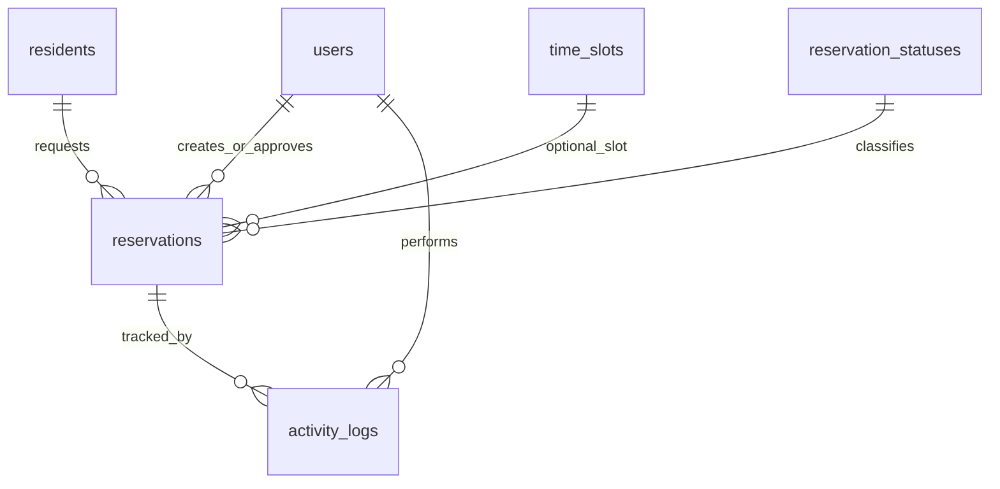

# Basketball Court Scheduling System for Barangay Sto. Niño, Parañaque City

## Project Documentation and Defense Reviewer

Generated: May 13, 2026

Repository / project name: `barangay-basketball-court-scheduler`

Group members from proposal:

- Roviklein P. Fabre

- Jacob Ethan R. Gabaldon

- Peter T. Guo

- Zedrick Lonzaga

- Benedict Riley D. Quizon

- Rhegille Gabriel L. Rodriguez

## Source Materials and Verification Rule

| Source | Location | Use |
| --- | --- | --- |
| Project proposal | Provided file: Project Proposal.pdf | Available and text-extracted with PyMuPDF. |
| Presentation slides | Provided file: Presentation Slides.pptx | Available and slide text extracted from the PPTX package. |
| Database diagram | Provided file: Database Diagram.jpg | Available and visually inspected. |
| Actual codebase | Project repository | Inspected from source files, SQL, scripts, views, tests, and existing docs. |

This document separates proposed requirements from implemented behavior. When the repository contains source-code, SQL, view, script, or test evidence, the feature is labeled Implemented. When a feature appears in the proposal or slides but not in code, it is labeled Proposed / Not yet verified in implementation or Not implemented.

## Executive Summary

The Basketball Court Scheduling System is an offline office-based system for Barangay Sto. Niño, Parañaque City. It helps barangay personnel encode, view, and manage basketball court reservations. Residents do not reserve remotely. They visit or coordinate with the barangay office, and authorized Admin or Staff users record the request in the system. The system solves the practical problem of unorganized scheduling by showing available and reserved time slots, preventing overlapping active reservations, and keeping updated reservation records. Offline deployment matches the barangay preference stated in the proposal and slides: the system is installed on a barangay office computer and is used locally through a browser interface.

## Project Background

The proposal describes the basketball court as a community venue for recreation, friendship, and social interaction. Because residents and groups may want the court at the same time, informal scheduling can lead to conflict and misunderstanding. A digital schedule is appropriate because the main problem is not payment or remote access; it is record organization, conflict prevention, and visibility. Barangay personnel remain the direct managers because the proposal states that the court is free for residents and that the barangay wants direct control to ensure proper and fair use.

## Project Objectives

| Objective | Meaning | Supporting feature | Defense talking point |
| --- | --- | --- | --- |
| Organize the reservation system | Move from informal arrangements to recorded reservations. | Reservations list, detail, add/edit forms, statuses. | The system creates a single office record for court use. |
| Prevent overlapping schedules | Stop two active groups from occupying the same date/time. | Application overlap query and MySQL triggers. | Conflict prevention is enforced before save and at database level. |
| Maximize court utilization | Make unused slots visible and easier to offer. | Schedule view, dashboard counts, nearest available slot. | Staff can quickly offer another open time. |
| Help personnel manage schedules | Give Admin/Staff a simple office interface. | Login, Home, Schedule, Reservations, Activity Logs. | The system supports actual barangay workflow instead of public self-service. |
| Maintain updated records | Keep stored history of reservations and status changes. | MySQL tables, activity logs, export/print. | Records remain searchable and printable. |
| Provide slot visibility | Show what is reserved and available. | Daily schedule and weekly dashboard. | The schedule is the main evidence that the court is organized. |

## Scope of the Project

Included scope verified from proposal, slides, and implementation:

- Offline installation at the barangay office.
- Reservation encoding by authorized personnel.
- Schedule monitoring and available/reserved slot display.
- Reservation create, view, edit, filter, export, print, and status update workflows.
- Admin account management and Staff/Admin login.
- Nearest available slot suggestion on the dashboard.
- Missed, Cancelled, and Completed status marking.
- Activity logs for reservation actions and account/password changes.
- Offline setup, startup, backup, restore, diagnostics, and sign-off scripts.

Outside scope:

- No online public booking.
- No resident self-service remote reservation.
- No online payment system.
- No mobile app.
- No multi-court or city-wide scheduling.
- No SMS/email notification.

## Limitations of the Study

| Limitation | Reason | Design choice or constraint | Defense answer | Future improvement |
| --- | --- | --- | --- | --- |
| Offline-only office use | Barangay officials prefer offline setup. | Design choice from proposal/slides. | It matches the barangay workflow and reduces dependence on internet. | Optional online portal or cloud backup. |
| Residents must coordinate with personnel | The barangay directly manages free court use. | Design choice. | The system supports staff encoding, not public self-service. | Resident request portal with approval workflow. |
| Barangay policies govern scheduling | Policy rules may vary. | Operational constraint. | The system enforces technical conflicts; barangay decides approval policy. | Configurable policy settings. |
| Target-PC sign-off needed | Deployment depends on actual local database/browser/printer. | Technical verification constraint. | Development evidence exists, but final deployment must be checked on site. | Automated installer report and checklist. |
| Backup/restore not in staff UI | Implemented as maintenance tooling. | Usability/security tradeoff. | This avoids normal staff accidentally restoring data. | Admin-only in-app backup screen. |

## Target Beneficiaries

| Beneficiary | Benefit |
| --- | --- |
| Residents of Barangay Sto. Niño | Fairer access and fewer schedule misunderstandings. |
| Youth organizations | Clearer practice/game schedules and less conflict with other groups. |
| Sports groups | More predictable court-use planning. |
| Barangay officials | Updated local records and easier monitoring. |
| Administrators / staff | Faster encoding, search, printing, status updates, and activity traceability. |

## System Users and Roles

| Role | Purpose | Permissions | Restrictions | Login behavior | Security implication |
| --- | --- | --- | --- | --- | --- |
| Admin | Manage users and reservations. | Login, dashboard, schedule, reservation CRUD/status, activity logs, account list/create/deactivate/reactivate, password change. | Cannot deactivate own signed-in account. | Active Admin username/password is checked with bcrypt. | Admin accounts should be limited and protected. |
| Staff | Operate daily reservation workflow. | Login, dashboard, schedule, reservation CRUD/status, activity logs, own password change. | Cannot access account list or create accounts. | Active Staff username/password is checked with bcrypt. | Staff can manage reservation data but not user access. |

## Complete Feature Guide

The normal staff workflow is the React console under `client/src` served through `src/features/frontend/reactAppRoutes.js` and `views/app.ejs`. Some feature rows also list legacy EJS views because those pages remain in the repository for compatibility and reference.

### Login and session authentication

| Item | Verified detail |
| --- | --- |
| Implementation status | Implemented |
| Role involved | Admin, Staff |
| Frontend/UI reference | views/login.ejs |
| Backend/API reference | src/features/users/authRoutes.js:27, src/features/users/userRepository.js:17 |
| Database reference | users |
| Workflow | The user enters username and password. The route lowercases the username, finds an active user, compares the submitted password with the bcrypt hash, stores userId/fullName/username/role in the session, and redirects to /dashboard. |
| Validation and errors | Invalid credentials return a generic error. Inactive users are not returned by findUserByUsername. |
| Defense explanation | The system uses account login so only authorized barangay personnel can encode and manage reservations. |

### Role-based access control

| Item | Verified detail |
| --- | --- |
| Implementation status | Implemented |
| Role involved | Admin, Staff |
| Frontend/UI reference | views/partials/navigation.ejs, views/account/*.ejs |
| Backend/API reference | src/features/users/authRoutes.js:204, src/features/users/sessionMiddleware.js:1 |
| Database reference | users.role, users.account_status |
| Workflow | All operational routes after auth routes use requireSignedIn. Account management uses requireAdmin. Staff accounts are sent directly to password change from Account navigation. |
| Validation and errors | Role is constrained to ADMIN or STAFF in SQL and in create-account validation. |
| Defense explanation | Admin has account-management authority; Staff can operate schedules and reservations but cannot create or deactivate accounts. |

### Admin account creation

| Item | Verified detail |
| --- | --- |
| Implementation status | Implemented |
| Role involved | Admin |
| Frontend/UI reference | views/account/index.ejs, views/account/create.ejs, views/account/success.ejs |
| Backend/API reference | src/features/users/authRoutes.js:119, src/features/users/userValidation.js:1, src/features/users/userRepository.js:38 |
| Database reference | users |
| Workflow | Admin opens Account, clicks Create Account, enters full name, username, password, and role. The system validates fields, checks duplicate username, hashes password, inserts ACTIVE account, and shows success. |
| Validation and errors | Full name, username, password, and role are required. Duplicate usernames return a username-specific error. |
| Defense explanation | This matches the slide workflow and limits account creation to an authorized Admin. |

### Account deactivate/reactivate

| Item | Verified detail |
| --- | --- |
| Implementation status | Implemented |
| Role involved | Admin |
| Frontend/UI reference | views/account/index.ejs |
| Backend/API reference | src/features/users/authRoutes.js:179, src/features/users/userRepository.js:120 |
| Database reference | users.account_status |
| Workflow | Admin clicks Deactivate or Reactivate on another user row. The system updates account_status. |
| Validation and errors | The current Admin cannot deactivate the account currently signed in. |
| Defense explanation | The barangay can remove access without deleting account history. |

### Change password

| Item | Verified detail |
| --- | --- |
| Implementation status | Implemented |
| Role involved | Admin, Staff |
| Frontend/UI reference | views/account/password.ejs |
| Backend/API reference | src/features/users/authRoutes.js:77, src/features/users/userValidation.js:37, src/features/users/userRepository.js:129 |
| Database reference | users.password_hash |
| Workflow | Signed-in user enters current password, new password, and confirmation. Current password is checked with bcrypt, then a new bcrypt hash is stored. |
| Validation and errors | Current password, new password, and confirmation are required. Confirmation must match. |
| Defense explanation | The starter password can be replaced after installation, which is important for office security. |

### Dashboard / Home schedule overview

| Item | Verified detail |
| --- | --- |
| Implementation status | Implemented |
| Role involved | Admin, Staff |
| Frontend/UI reference | views/dashboard.ejs |
| Backend/API reference | src/features/schedule/dashboardRoutes.js:18, src/features/schedule/scheduleService.js:86 |
| Database reference | time_slots, reservations, reservation_statuses |
| Workflow | The dashboard collects today, upcoming, suggestion, and weekly reservation data, builds daily and weekly schedules, counts available/reserved/missed slots, and displays nearest available slot. |
| Validation and errors | Database errors are caught and shown as a controlled database-unavailable message. |
| Defense explanation | Home gives personnel a quick operational view before accepting a resident request. |

### Daily schedule viewing

| Item | Verified detail |
| --- | --- |
| Implementation status | Implemented |
| Role involved | Admin, Staff |
| Frontend/UI reference | views/schedule/index.ejs |
| Backend/API reference | src/features/schedule/scheduleRoutes.js:12, src/features/schedule/scheduleService.js:11 |
| Database reference | time_slots, reservations |
| Workflow | Personnel select a date. The system maps active time slots against reservations for that date, marks open slots as Available, and links reserved slots to details. |
| Validation and errors | Unavailable database returns a clear message instead of crashing the app. |
| Defense explanation | The schedule screen answers the main office question: what time is free and what time is already reserved? |

### Reservation creation

| Item | Verified detail |
| --- | --- |
| Implementation status | Implemented |
| Role involved | Admin, Staff |
| Frontend/UI reference | views/reservations/new.ejs |
| Backend/API reference | src/features/reservations/reservationRoutes.js:182, src/features/reservations/reservationRepository.js:233, src/features/reservations/reservationValidation.js:5 |
| Database reference | reservations, residents, reservation_statuses, activity_logs |
| Workflow | Staff enters date, start time, end time, representative name, contact number, address, purpose, and remarks. The system validates input, checks overlap, creates/reuses resident, inserts reservation, and writes CREATE_RESERVATION log. |
| Validation and errors | Date, start time, end time, representative, contact, address, and purpose are required. End time must be after start time. Date cannot be before today. |
| Defense explanation | Reservation creation digitizes the staff encoding process while preserving in-person resident coordination. |

### Reservation overlap prevention

| Item | Verified detail |
| --- | --- |
| Implementation status | Implemented |
| Role involved | Admin, Staff |
| Frontend/UI reference | Reservation form error display |
| Backend/API reference | src/features/reservations/reservationRepository.js:135, src/features/reservations/reservationOverlap.js:41 |
| Database reference | database/schema.sql:147, database/schema.sql:183 |
| Workflow | Before insert/update, the repository searches for a blocking same-date overlap. MySQL triggers also reject direct overlapping writes where both records are blocking. |
| Validation and errors | The overlap rule is startA < endB and endA > startB. Adjacent slots are allowed. Only RESERVED blocks. |
| Defense explanation | Double booking is prevented in both application logic and database logic. |

### Reservation editing

| Item | Verified detail |
| --- | --- |
| Implementation status | Implemented |
| Role involved | Admin, Staff |
| Frontend/UI reference | views/reservations/edit.ejs |
| Backend/API reference | src/features/reservations/reservationRoutes.js:90, src/features/reservations/reservationRepository.js:285 |
| Database reference | reservations, residents, activity_logs |
| Workflow | Personnel open an existing record, edit details, pass the same validation and overlap checks, then the system updates the row and logs UPDATE_RESERVATION. |
| Validation and errors | Same reservation validation rules apply. Missing row returns not found. |
| Defense explanation | Edits support realistic office corrections while keeping the conflict rule active. |

### Reservation status updates

| Item | Verified detail |
| --- | --- |
| Implementation status | Implemented |
| Role involved | Admin, Staff |
| Frontend/UI reference | views/reservations/index.ejs, views/reservations/show.ejs |
| Backend/API reference | src/features/reservations/reservationRoutes.js:214, src/features/reservations/reservationRepository.js:328 |
| Database reference | reservation_statuses, reservations, activity_logs |
| Workflow | Personnel mark a record MISSED, CANCELLED, or COMPLETED. The status is updated and an activity log is written. |
| Validation and errors | Only MISSED, CANCELLED, and COMPLETED are accepted by the route. |
| Defense explanation | The system preserves schedule history and can record no-shows or finished reservations. |

### Reservation list, filtering, print, and CSV export

| Item | Verified detail |
| --- | --- |
| Implementation status | Implemented |
| Role involved | Admin, Staff |
| Frontend/UI reference | views/reservations/index.ejs |
| Backend/API reference | src/features/reservations/reservationRoutes.js:29, src/features/reservations/reservationExport.js:13 |
| Database reference | reservations, residents, reservation_statuses, users |
| Workflow | Personnel filter by date, status, name/contact, or purpose. They can print records or export filtered records as reservations.csv. |
| Validation and errors | Export uses the same filters as the list. |
| Defense explanation | Reports and printed records support barangay documentation without adding online services. |

### Activity logs

| Item | Verified detail |
| --- | --- |
| Implementation status | Implemented |
| Role involved | Admin, Staff |
| Frontend/UI reference | client/src/pages/ActivityLogsPage.jsx; legacy views/activityLogs/index.ejs |
| Backend/API reference | src/features/activityLogs/activityLogRoutes.js:13, src/features/activityLogs/activityLogRepository.js:1 |
| Database reference | activity_logs |
| Workflow | Reservation create/edit/status and account create/status/password-change actions write logs. The log page filters by date, action, and user/details search. |
| Validation and errors | Log list is limited to 200 recent records. |
| Defense explanation | Logs give the barangay traceability for who encoded or changed reservation records. |

### Nearest available slot suggestion

| Item | Verified detail |
| --- | --- |
| Implementation status | Implemented |
| Role involved | Admin, Staff |
| Frontend/UI reference | views/dashboard.ejs |
| Backend/API reference | src/features/schedule/scheduleService.js:66 |
| Database reference | time_slots, reservations |
| Workflow | The service searches from today across a 14-day window and returns the first non-blocking slot. |
| Validation and errors | The search depends on seeded active time slots and reservation statuses. |
| Defense explanation | This supports the proposal requirement to suggest the next possible time when a requested slot is unavailable. |

### React staff console and legacy prototype bridge

| Item | Verified detail |
| --- | --- |
| Implementation status | Implemented |
| Role involved | Admin, Staff |
| Frontend/UI reference | client/src, public/app, views/app.ejs; legacy public/prototype and public/js/prototype-backend.js |
| Backend/API reference | src/features/frontend/reactAppRoutes.js; src/features/api/apiRoutes.js; legacy src/features/prototype/prototypeRoutes.js and src/features/prototype/prototypeApiRoutes.js |
| Database reference | users, reservations, residents |
| Workflow | The normal staff workflow uses the React console at /login, /dashboard, /schedule, /reservations, /reports, /activity-logs, and /account routes. Legacy prototype routes remain available for compatibility/reference checks. |
| Validation and errors | Routes require session login; account API requires Admin role. |
| Defense explanation | The browser UI is local and backend-backed. The current React staff console follows the Barangay (1) staff-friendly reference while persistence remains in the local Express/MySQL backend. |

### Offline startup and maintenance scripts

| Item | Verified detail |
| --- | --- |
| Implementation status | Implemented |
| Role involved | Installer/Admin, Staff |
| Frontend/UI reference | START-HERE.bat, start-barangay-office.bat, maintenance-tools/*.bat |
| Backend/API reference | scripts/*.mjs, scripts/*.ps1, src/serverStartup.js |
| Database reference | Local MySQL/MariaDB from .env or bundled runtime |
| Workflow | START-HERE.bat provides setup and maintenance. start-barangay-office.bat checks runtime, .env, database readiness, starts local app, and opens the browser. |
| Validation and errors | Scripts verify Node, npm, node_modules, .env, database connectivity, bundle contents, and runtime package readiness. |
| Defense explanation | The system is offline because the server and database run on the barangay computer and the browser is only the local interface. |

### Database backup and restore

| Item | Verified detail |
| --- | --- |
| Implementation status | Implemented as scripts, not in-app buttons |
| Role involved | Installer/Admin or technical support |
| Frontend/UI reference | maintenance-tools/backup-database.bat, maintenance-tools/restore-database.bat |
| Backend/API reference | scripts/backup-mysql.mjs, scripts/restore-mysql.mjs |
| Database reference | MySQL/MariaDB database dump |
| Workflow | Backup uses mysqldump with routines/triggers. Restore requires an explicit .sql file path. |
| Validation and errors | Tests cover backup/restore helpers. Actual restore should be handled carefully because it can replace data. |
| Defense explanation | Backup/restore exists as maintenance tooling, not as a normal staff screen. |

## User Workflow Guide

| Step | Actor | Action | System behavior | Implementation status |
| --- | --- | --- | --- | --- |
| 1 | Admin/Staff | Open local office URL. | Local Express app serves the React staff console login. | Implemented |
| 2 | Admin/Staff | Log in. | Session created after bcrypt password match. | Implemented |
| 3 | Admin | Create Staff account if needed. | User is validated, password-hashed, and inserted. | Implemented |
| 4 | Resident | Visits or coordinates with barangay office. | No resident account or remote booking needed. | Implemented by scope |
| 5 | Staff/Admin | Checks Schedule/Home. | Available and reserved slots are displayed. | Implemented |
| 6 | Staff/Admin | Encodes reservation. | Required fields are validated. | Implemented |
| 7 | System | Checks conflict. | Existing blocking reservation overlap is rejected. | Implemented |
| 8 | System | Saves reservation. | Resident row is reused/created, reservation inserted, log written. | Implemented |
| 9 | Staff/Admin | Updates status later. | MISSED, CANCELLED, or COMPLETED can be applied. | Implemented |
| 10 | Staff/Admin | Print/export/review logs. | Records remain available for reporting. | Implemented |

## Account Creation Workflow

| Slide/proposal step | Implementation verification |
| --- | --- |
| Admin logs in and navigates to Account Management. | Implemented: /account is Admin-only. |
| Admin clicks Create Account. | Implemented: views/account/index.ejs links to /account/create. |
| Admin enters Full Name, Username, Password, Role. | Implemented: views/account/create.ejs. |
| System validates required fields. | Implemented: validateCreateUserInput. |
| System checks duplicate usernames. | Implemented: findAnyUserByUsername plus users unique index. |
| System saves account. | Implemented: createUser hashes password and inserts ACTIVE account. |
| New user logs in. | Implemented: login route accepts active Admin/Staff accounts. |

## Reservation Management Workflow

Required reservation data verified in code and schema: reservation date, start time, end time, resident/group representative name, contact number, address, purpose, status, and optional remarks. The repository stores resident details in `residents`, reservation timing and status in `reservations`, status definitions in `reservation_statuses`, and action history in `activity_logs`. Overlap prevention checks same date, blocking status, and intersecting time ranges using `new.start < existing.end` and `new.end > existing.start`.

## Database Guide

| Table | Purpose | Important fields | Constraints/indexes | Supported features |
| --- | --- | --- | --- | --- |
| users | Admin and Staff accounts | user_id, full_name, username, password_hash, role, account_status | Unique username; role ADMIN/STAFF; active/inactive status | Login, account management, reservation creator/approver, activity logs |
| residents | Resident or group representative records | resident_id, full_name, contact_no, address | Indexes on name and contact | Reservation representative details |
| reservation_statuses | Reference status list | status_id, status_code, status_name, is_blocking, display_order | Unique status code; is_blocking 0/1 | Reserved blocks; Available/Missed/Cancelled/Completed do not block |
| time_slots | Default schedule slots | slot_id, name, start_time, end_time, display_order, is_active | Unique time range; end_time > start_time | Schedule grid and nearest-slot search |
| court_settings | Local system settings | setting_key, setting_value, description, updated_at | Primary key setting_key | Barangay/court/timezone/opening/closing settings |
| reservations | Reservation transaction records | reservation_id, resident_id, time_slot_id, status_id, approved_by_user_id, created_by_user_id, reservation_date, start_time, end_time, purpose, remarks | Foreign keys; date/time indexes; end_time > start_time | Core reservation management |
| activity_logs | Activity trail for reservation and account/password actions | log_id, reservation_id, user_id, action, details, created_at | Foreign keys to reservations/users; indexes | Activity log monitoring |

### ERD / Relationship Explanation

The proposal diagram used STAFF, RESIDENTS, RESERVATIONS, TIME_SLOTS, RESERVATION_STATUS, and LOGS. The implementation keeps those concepts but renames STAFF to `users` so both Admin and Staff accounts are handled in one table. The implementation also replaces the diagram's plaintext `password` field with `password_hash`, which is a security improvement.

## Backend Architecture

| Module | File | Defense explanation |
| --- | --- | --- |
| Root/runtime | package.json | Defines Node/Express app, scripts, dependencies, Node >=20 requirement. |
| Root/runtime | .env.example | Documents local app/database/verification environment variables. |
| Entry point | src/server.js | Loads dotenv, creates app, starts local server on APP_PORT. |
| Entry point | src/app.js | Creates Express app, session middleware, static files, auth routes, protected feature routes. |
| Startup | src/serverStartup.js | Builds office URL, checks already-running app, opens browser only when requested. |
| Database | src/config/database.js | Creates mysql2 promise pool from DB_HOST, DB_PORT, DB_NAME, DB_USER, and DB_PASSWORD. |
| Users | src/features/users/authRoutes.js | Login, logout, account list/create/status, and password change routes. |
| Users | src/features/users/userRepository.js | User queries, duplicate username check, bcrypt hashing, status/password updates. |
| Users | src/features/users/userValidation.js | Create-account and password-change validation. |
| Users | src/features/users/sessionMiddleware.js | Redirects unauthenticated users to login. |
| Reservations | src/features/reservations/reservationRoutes.js | Reservation list/export/new/show/edit/status routes. |
| Reservations | src/features/reservations/reservationRepository.js | Reservation SQL, resident creation/reuse, status lookup, overlap query, logs. |
| Reservations | src/features/reservations/reservationValidation.js | Date/time/person/contact/address/purpose/status validation. |
| Reservations | src/features/reservations/reservationOverlap.js | Pure time-overlap helper logic. |
| Reservations | src/features/reservations/reservationExport.js | CSV export formatting. |
| Schedule | src/features/schedule/scheduleService.js | Daily/weekly schedule mapping, nearest slot, dashboard summary. |
| Schedule | src/features/schedule/dashboardRoutes.js | Home dashboard data assembly. |
| Schedule | src/features/schedule/scheduleRoutes.js | Daily schedule page. |
| Activity logs | src/features/activityLogs/activityLogRepository.js | Activity log filter query and row mapping. |
| Activity logs | src/features/activityLogs/activityLogRoutes.js | Activity log page route. |
| React staff console | src/features/frontend/reactAppRoutes.js, client/src, public/app | Serves the normal Barangay (1)-style staff workflow backed by Express APIs. |
| Prototype | src/features/prototype/prototypeRoutes.js | Serves supplied prototype for legacy/reference checks. |
| Prototype | src/features/prototype/prototypeApiRoutes.js | JSON API for prototype login, reservations, statuses, and accounts. |
| Views | views/*.ejs | Legacy server-rendered pages and shared React host template. |
| Assets | public/css/styles.css | Barangay-style red/gold/tan interface and print styles. |
| Assets | public/js/prototype-backend.js | Connects prototype UI to backend API. |
| SQL | database/schema.sql | Creates database, tables, foreign keys, checks, indexes, and overlap triggers. |
| SQL | database/seed.sql | Seeds starter admin, statuses, hourly slots, and court settings. |
| SQL | database/diagnostics.sql | Read-only database setup checks. |
| Offline setup | START-HERE.bat | Main setup/maintenance launcher. |
| Offline setup | start-barangay-office.bat | Daily startup launcher. |
| Offline setup | maintenance-tools/*.bat | Setup, backup, restore, readiness, shortcut, sign-off wrappers. |
| Scripts | scripts/*.mjs and scripts/*.ps1 | Verification, setup, runtime, backup/restore, and bundling automation. |
| Tests | tests/*.test.js | 32 Node test files for routes, repositories, validation, SQL/static checks, offline tooling, and UI smoke checks. |

## Frontend / UI / UX Architecture

| Page/screen | Route | Purpose | Inputs/actions | Backend interaction |
| --- | --- | --- | --- | --- |
| React staff console | /login, /dashboard, /schedule, /reservations, /reports, /activity-logs, /account, /account/password | Normal staff/admin office workflow. | Backend-backed login, schedule, reservation, report, log, account, and password actions. | createReactAppRoutes and apiRoutes. |
| Legacy prototype | /prototype | Compatibility/reference frontend. | Prototype login/reservation/account actions. | prototypeApiRoutes JSON endpoints. |
| Login | /login | Authenticate Admin/Staff. | Username and password. | authRoutes and API session routes. |
| Home | /dashboard | Today/weekly schedule overview. | Click available/reserved slots, Add Reservation. | dashboardRoutes and scheduleService. |
| Schedule | /schedule | Daily slot display. | Date selector, Reserve/View Details, Print Schedule. | scheduleRoutes and reservation queries. |
| Reservations | /reservations | Record list and status actions. | Filters, print, export, add, edit, status forms. | reservationRoutes and reservationRepository. |
| Reservation detail | /reservations/:id | Representative and booking details. | Edit, status update, back to schedule/list. | getReservationById. |
| Add/Edit reservation | /reservations/new, /reservations/:id/edit | Encode or update reservation. | Date/time/representative/contact/address/purpose/remarks. | validateReservationInput and create/update repository calls. |
| Account | /account | Admin user management. | Create, deactivate/reactivate, change password. | Admin-only authRoutes. |
| Change Password | /account/password | Signed-in user password update. | Current/new/confirm password. | bcrypt compare and new hash update. |
| Activity Logs | /activity-logs | Monitor reservation actions and account/password changes. | Date/action/search filters. | activityLogRepository query. |

## Offline Deployment Explanation

The system is not a public website. It is a local web application: the browser is the interface, Express is the local server, and MySQL/MariaDB is the local database. The barangay office computer hosts the system through `localhost`. The scripts prefer bundled runtime folders when supplied and fall back to locally installed tools for development or technical support. Normal daily use starts from `start-barangay-office.bat`; first-time setup and maintenance start from `START-HERE.bat`.

## Installation and Setup Guide

| Area | Verified files | Explanation |
| --- | --- | --- |
| Prerequisites | README.md, docs/DEPLOYMENT_GUIDE.md | Windows, Node.js 20+, local MySQL/MariaDB or bundled runtime, browser, node_modules. |
| Environment | .env.example, scripts/setup-env.mjs | Defines APP_PORT, APP_SESSION_SECRET, DB connection, backup settings, verifier login values. |
| Database setup | database/schema.sql, seed.sql, diagnostics.sql, setup-database-only.bat | Creates database/tables/triggers, seeds default records, runs diagnostics. |
| First-time setup | START-HERE.bat, maintenance-tools/setup-barangay-office.bat | Guides office setup and checks local files/tools. |
| Daily startup | start-barangay-office.bat | Checks runtime, .env, database, starts app, opens local URL. |
| Backup/restore | scripts/backup-mysql.mjs, scripts/restore-mysql.mjs | Creates/restores SQL dump files using MySQL tools. |
| Verification | scripts/verify-*.mjs, npm scripts | Static SQL, UI smoke, bundle, runtime, MySQL, and test verification. |

## Security Explanation

Security claims should be realistic. Verified safeguards include bcrypt password hashing, active-account filtering during login, Admin-only account-management middleware, express-session cookies with httpOnly and sameSite=lax, parameterized MySQL queries, duplicate username checks, account/password activity logs, and offline local storage of resident contact/address data. Risks remain: shared office passwords, unattended unlocked computer, exposed `.env`, unprotected backups, and no complete audit trail for login/logout or maintenance events. Recommended safeguards are changing the starter password, using separate accounts, locking the office computer, restricting backup access, and keeping the database local.

## ISO 25010 Evaluation Mapping

| Characteristic | Simple definition | Evidence | Weakness | Defense talking point |
| --- | --- | --- | --- | --- |
| Functional suitability | Does the system provide needed functions? | Reservations, schedules, overlap prevention, accounts, logs, export/print. | Barangay policy rules beyond conflict prevention are not deeply encoded. | It satisfies the core scheduling problem. |
| Performance efficiency | Does it respond acceptably? | Built React assets, Express API routes, and indexed SQL queries. | Needs target-PC test with real data volume. | Simple local stack is appropriate for one-office use. |
| Compatibility | Does it work in target environment? | Browser interface, local MySQL/MariaDB, Windows scripts. | Final office computer sign-off required. | It is designed for local Windows office use. |
| Usability | Is it understandable for users? | Barangay (1)-style React login, Home, Schedule, Reservations, Reports, Activity Logs, Account, and Password screens. | Final office user sign-off is still required. | Staff can follow clear office workflows. |
| Reliability | Does it avoid failures and invalid records? | Validation, SQL constraints, triggers, controlled DB errors. | Power/database failure still needs backup discipline. | App and database both protect core conflict rule. |
| Security | Does it protect accounts and data? | bcrypt, sessions, roles, local DB, parameterized queries, account/password activity logs. | No MFA and no complete audit for login/logout or maintenance events. | Security is suitable for a local student office system but not overclaimed. |
| Maintainability | Can it be modified and tested? | Feature folders, SQL files, 32 test files, docs. | No migration framework yet. | The code is organized by feature and backed by tests. |
| Portability | Can it move to another computer? | Offline bundle scripts and .env configuration. | Runtime folders must be included or installed. | It can be prepared as a copyable Windows folder. |

## Testing Guide

The repository contains 32 automated test files under `tests/`. Existing tests cover route behavior, validation, repositories, schedule logic, SQL static checks, offline bundle checks, startup scripts, backup/restore helpers, UI smoke rendering, and MySQL verification helpers. Live MySQL verification is separate from `npm test` and requires a reachable local database.

| Test ID | Feature | Scenario | Steps | Expected result | Actual implementation status | Priority |
| --- | --- | --- | --- | --- | --- | --- |
| TC-01 | Login | Valid active account | Open login, enter valid username/password, submit. | Redirect to dashboard. | Implemented and covered by auth route tests. | High |
| TC-02 | Login | Invalid credentials | Submit wrong username or password. | Generic invalid username or password error. | Implemented and covered. | High |
| TC-03 | Account creation | Valid Staff account | Admin opens Account > Create Account, fills all fields. | Account saved; success screen shown. | Implemented and covered. | High |
| TC-04 | Account creation | Duplicate username | Create account with existing username. | Username already exists error. | Implemented and covered. | High |
| TC-05 | Account status | Deactivate Staff | Admin clicks Deactivate on another account. | Account becomes inactive. | Implemented and covered. | Medium |
| TC-06 | Account status | Self-deactivation | Admin attempts to deactivate current account. | System rejects action. | Implemented and covered. | Medium |
| TC-07 | Reservation | Available slot | Enter valid reservation for open date/time. | Reservation saved and listed. | Implemented and covered. | High |
| TC-08 | Reservation | Overlapping slot | Try to reserve time overlapping a RESERVED record. | Conflict message; record not saved. | Implemented and covered. | High |
| TC-09 | Reservation | Adjacent slot | Reserve 8-9 after 7-8 record. | Allowed. | Implemented and covered by overlap tests. | Medium |
| TC-10 | Reservation | Past date | Submit date before today. | Rejected when route requires today/future. | Implemented and covered. | Medium |
| TC-11 | Reservation edit | Change valid reservation | Open detail, edit date/time/details. | Updated details displayed. | Implemented and covered. | High |
| TC-12 | Reservation edit | Edit into conflict | Move reservation into existing blocking slot. | Rejected. | Implemented and covered. | High |
| TC-13 | Status | Mark Missed | Click Missed on list/detail. | Status changes; log written. | Implemented and covered. | High |
| TC-14 | Status | Mark Completed | Click Completed. | Status changes; log written. | Implemented and covered. | Medium |
| TC-15 | Status | Cancel | Click Cancelled. | Status changes; log written. | Implemented and covered. | Medium |
| TC-16 | Schedule | View schedule | Open Schedule for date. | Slots show available or reservation detail links. | Implemented and covered. | High |
| TC-17 | Dashboard | Nearest available | Open dashboard with mixed slot data. | Nearest available slot appears when found. | Implemented and covered. | Medium |
| TC-18 | Activity logs | Filter logs | Open Activity Logs and filter by action/date/search. | Matching recent logs shown. | Implemented and covered. | Medium |
| TC-19 | Export | CSV export | Filter reservations and click Export CSV. | Filtered CSV downloads. | Implemented and covered. | Medium |
| TC-20 | Print | Print records/schedule | Click Print Records or Print Schedule. | Browser print dialog with print-friendly content. | Implemented in UI/CSS; printer output requires office check. | Medium |
| TC-21 | Offline startup | Daily launcher | Run start-barangay-office.bat. | Checks runtime/database and starts local app. | Implemented and covered by script tests. | High |
| TC-22 | Database unavailable | MySQL stopped | Open app when database cannot connect. | Controlled database-unavailable message. | Implemented and covered. | High |
| TC-23 | Backup | Create backup | Run maintenance backup command. | Timestamped SQL file created. | Implemented and tested as script helper; live office check needed. | Medium |
| TC-24 | Restore | Restore explicit .sql | Run restore with backup path. | Database restored. | Implemented and tested as script helper; use carefully. | Medium |

## Defense Explanation by Topic

| Topic | Strong answer |
| --- | --- |
| Why this project? | The barangay court is a shared community facility, and an organized digital schedule reduces conflicts. |
| Why offline? | The barangay preference is direct office management, and offline use avoids internet dependency for daily operation. |
| Who are users? | Admin and Staff accounts for authorized barangay personnel; residents do not log in. |
| How prevent double booking? | The app checks overlapping blocking reservations and MySQL triggers reject direct overlapping inserts/updates. |
| What database? | Local MySQL target, with MariaDB acceptable if verified. |
| Main tables? | users, residents, reservation_statuses, time_slots, court_settings, reservations, activity_logs. |
| How login works? | Username lookup for ACTIVE account, bcrypt password compare, session stores role and user identity. |
| What limitations? | Offline only, no remote resident booking, one court, no payment, final office sign-off needed. |
| How ISO 25010 applies? | Use the eight quality characteristics to evaluate functions, usability, reliability, security, maintainability, and deployment readiness. |
| How improve later? | Online portal, SMS, mobile-friendly UI, multi-court support, analytics, cloud backup, QR confirmation. |

## Defense Q&A Reviewer

A separate file, `docs/DEFENSE_QA_REVIEWER.md`, contains 88 likely panel questions with suggested answers grouped by topic.

## Implementation Verification Report

A separate file, `docs/IMPLEMENTATION_VERIFICATION_REPORT.md`, compares proposed requirements against actual implementation evidence.

## Glossary

| Term | Meaning |
| --- | --- |
| Offline system | A system used locally without requiring internet for normal operation. |
| Localhost | The local computer address used by the browser to reach the local server. |
| Database | Structured storage for accounts, residents, reservations, statuses, settings, and logs. |
| MySQL/MariaDB | Relational database engines used for local data storage. |
| Reservation | A saved request for court use on a specific date and time. |
| Time slot | A defined period such as 7:00 AM to 8:00 AM. |
| Admin | Authorized user who can manage accounts and reservations. |
| Staff | Authorized user who can manage schedules and reservations but not accounts. |
| CRUD | Create, Read, Update, Delete; here the closest workflow is create/read/update/status-change. |
| Authentication | Confirming a user's identity through login. |
| Authorization | Checking what a signed-in user is allowed to do. |
| ISO 25010 | Software quality model used for evaluation. |
| Backup | A copy of database data saved for recovery. |
| Deployment | Installing and preparing the system for real use. |
| ERD | Entity Relationship Diagram showing database entities and links. |
| API | Backend endpoint used by UI code to send/receive data. |
| Frontend | React staff console, with legacy prototype/reference screens retained. |
| Backend | Server-side Express routes, validation, and database logic. |

## Future Enhancements

The following are future enhancements, not current implemented features: online reservation portal, SMS notifications, resident self-service mobile view, multi-court support, barangay announcement integration, printable reservation reports beyond current print/export, advanced analytics, cloud backup, QR-code reservation confirmation, and a fuller audit trail for login/logout, backup, restore, and maintenance events.

## Codebase Explanation for Defense

The programming language is JavaScript running on Node.js. The backend framework is Express. The normal staff interface is a React 18/Vite console served from local built assets, with EJS retained for legacy pages and the React host template. The database layer uses mysql2 with named placeholders. Sessions are handled by express-session. Password hashing uses bcryptjs. Environment configuration uses dotenv. The main code flow is: browser request -> Express route/API -> validation/service/repository -> MySQL query -> React UI update, EJS page, or JSON response.

Reservation creation code flow: the user fills the reservation form; `reservationRoutes.js` calls `validateReservationInput`; `reservationRepository.js` checks overlap; the repository creates or reuses a resident; it finds the RESERVED status id; it inserts the reservation; it writes an activity log; then the browser is redirected to the reservation list. Schedule conflict prevention is implemented in the repository overlap query and backed by MySQL triggers in `database/schema.sql`.

The most important files to explain during defense are `src/app.js`, `src/features/frontend/reactAppRoutes.js`, `src/features/api/apiRoutes.js`, `client/src/App.jsx`, `client/src/pages/*`, `src/features/users/authRoutes.js`, `src/features/reservations/reservationRepository.js`, `src/features/schedule/scheduleService.js`, `database/schema.sql`, and `database/seed.sql`.

| Major feature | Frontend file/page | Backend route/service | Database table | Plain code flow |
| --- | --- | --- | --- | --- |
| Login and session authentication | views/login.ejs | src/features/users/authRoutes.js:27, src/features/users/userRepository.js:17 | users | The user enters username and password. The route lowercases the username, finds an active user, compares the submitted password with the bcrypt hash, stores userId/fullName/username/role in the session, and redirects to /dashboard. |
| Role-based access control | views/partials/navigation.ejs, views/account/*.ejs | src/features/users/authRoutes.js:204, src/features/users/sessionMiddleware.js:1 | users.role, users.account_status | All operational routes after auth routes use requireSignedIn. Account management uses requireAdmin. Staff accounts are sent directly to password change from Account navigation. |
| Admin account creation | views/account/index.ejs, views/account/create.ejs, views/account/success.ejs | src/features/users/authRoutes.js:119, src/features/users/userValidation.js:1, src/features/users/userRepository.js:38 | users | Admin opens Account, clicks Create Account, enters full name, username, password, and role. The system validates fields, checks duplicate username, hashes password, inserts ACTIVE account, and shows success. |
| Account deactivate/reactivate | views/account/index.ejs | src/features/users/authRoutes.js:179, src/features/users/userRepository.js:120 | users.account_status | Admin clicks Deactivate or Reactivate on another user row. The system updates account_status. |
| Change password | views/account/password.ejs | src/features/users/authRoutes.js:77, src/features/users/userValidation.js:37, src/features/users/userRepository.js:129 | users.password_hash | Signed-in user enters current password, new password, and confirmation. Current password is checked with bcrypt, then a new bcrypt hash is stored. |
| Dashboard / Home schedule overview | views/dashboard.ejs | src/features/schedule/dashboardRoutes.js:18, src/features/schedule/scheduleService.js:86 | time_slots, reservations, reservation_statuses | The dashboard collects today, upcoming, suggestion, and weekly reservation data, builds daily and weekly schedules, counts available/reserved/missed slots, and displays nearest available slot. |
| Daily schedule viewing | views/schedule/index.ejs | src/features/schedule/scheduleRoutes.js:12, src/features/schedule/scheduleService.js:11 | time_slots, reservations | Personnel select a date. The system maps active time slots against reservations for that date, marks open slots as Available, and links reserved slots to details. |
| Reservation creation | views/reservations/new.ejs | src/features/reservations/reservationRoutes.js:182, src/features/reservations/reservationRepository.js:233, src/features/reservations/reservationValidation.js:5 | reservations, residents, reservation_statuses, activity_logs | Staff enters date, start time, end time, representative name, contact number, address, purpose, and remarks. The system validates input, checks overlap, creates/reuses resident, inserts reservation, and writes CREATE_RESERVATION log. |
| Reservation overlap prevention | Reservation form error display | src/features/reservations/reservationRepository.js:135, src/features/reservations/reservationOverlap.js:41 | database/schema.sql:147, database/schema.sql:183 | Before insert/update, the repository searches for a blocking same-date overlap. MySQL triggers also reject direct overlapping writes where both records are blocking. |
| Reservation editing | views/reservations/edit.ejs | src/features/reservations/reservationRoutes.js:90, src/features/reservations/reservationRepository.js:285 | reservations, residents, activity_logs | Personnel open an existing record, edit details, pass the same validation and overlap checks, then the system updates the row and logs UPDATE_RESERVATION. |
| Reservation status updates | views/reservations/index.ejs, views/reservations/show.ejs | src/features/reservations/reservationRoutes.js:214, src/features/reservations/reservationRepository.js:328 | reservation_statuses, reservations, activity_logs | Personnel mark a record MISSED, CANCELLED, or COMPLETED. The status is updated and an activity log is written. |
| Reservation list, filtering, print, and CSV export | views/reservations/index.ejs | src/features/reservations/reservationRoutes.js:29, src/features/reservations/reservationExport.js:13 | reservations, residents, reservation_statuses, users | Personnel filter by date, status, name/contact, or purpose. They can print records or export filtered records as reservations.csv. |
| Activity logs | client/src/pages/ActivityLogsPage.jsx; legacy views/activityLogs/index.ejs | src/features/activityLogs/activityLogRoutes.js:13, src/features/activityLogs/activityLogRepository.js:1 | activity_logs | Reservation create/edit/status and account create/status/password-change actions write logs. The log page filters by date, action, and user/details search. |
| Nearest available slot suggestion | views/dashboard.ejs | src/features/schedule/scheduleService.js:66 | time_slots, reservations | The service searches from today across a 14-day window and returns the first non-blocking slot. |
| React staff console and legacy prototype bridge | client/src, public/app, views/app.ejs; legacy public/prototype and public/js/prototype-backend.js | src/features/frontend/reactAppRoutes.js, src/features/api/apiRoutes.js; legacy prototypeRoutes/prototypeApiRoutes | users, reservations, residents | The normal staff workflow uses the React console and real backend APIs. Legacy prototype routes remain for compatibility/reference checks. |
| Offline startup and maintenance scripts | START-HERE.bat, start-barangay-office.bat, maintenance-tools/*.bat | scripts/*.mjs, scripts/*.ps1, src/serverStartup.js | Local MySQL/MariaDB from .env or bundled runtime | START-HERE.bat provides setup and maintenance. start-barangay-office.bat checks runtime, .env, database readiness, starts local app, and opens the browser. |
| Database backup and restore | maintenance-tools/backup-database.bat, maintenance-tools/restore-database.bat | scripts/backup-mysql.mjs, scripts/restore-mysql.mjs | MySQL/MariaDB database dump | Backup uses mysqldump with routines/triggers. Restore requires an explicit .sql file path. |

## Final Defense Summary

The system is an offline office-based scheduling tool for Barangay Sto. Niño's basketball court. Its core value is simple: authorized barangay personnel can see available slots, encode reservations, prevent conflicts, update statuses, and keep records without requiring residents to book online.

**60-second project script:** Our project is a Basketball Court Scheduling System for Barangay Sto. Niño, Parañaque City. The barangay basketball court is shared by residents, so informal scheduling can lead to conflicts. Our system is installed offline in the barangay office. Residents still coordinate with barangay personnel in person, and authorized Admin or Staff users encode reservations. The system shows available and reserved slots, prevents overlapping active reservations, records resident representative details, supports account management, and keeps activity logs. This improves organization, fairness, and record keeping while matching the barangay's preference for direct office management.

**Technical architecture script:** The system uses Node.js and Express for the local backend, a React staff console for normal office use, legacy EJS/reference pages where needed, and a local MySQL/MariaDB database. The browser opens localhost, which means it is only talking to the local barangay computer. Express routes and APIs handle login, schedules, reservations, accounts, reports, and logs. The database stores users, residents, reservations, time slots, statuses, settings, and activity logs. Passwords are hashed with bcrypt, and reservation conflicts are checked in both code and database triggers.

**Offline deployment script:** We chose offline deployment because the proposal and slides state that barangay officials prefer an office-installed system and residents should coordinate directly with personnel. The browser is only the interface; the server and database run locally. This means normal operation does not require public internet, and the barangay keeps reservation records on its office computer.
